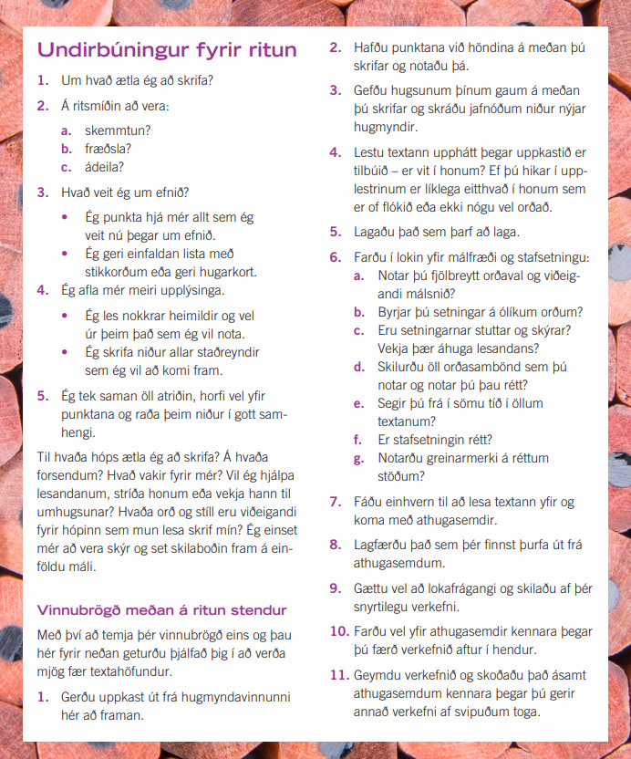

```{r setup, include=FALSE}
options(htmltools.dir.version = FALSE)
library(kableExtra)
knitr::opts_chunk$set(
  cache = FALSE,
  echo = FALSE,
  message = FALSE, 
  warning = FALSE,
  hiline = TRUE
)
```

```{r xaringan-themer, include=FALSE, warning=FALSE}
library(xaringanthemer)
style_duo_accent(
  primary_color = "#1381B0",
  secondary_color = "#FF961C",
  inverse_header_color = "#FFFFFF",
  inverse_background_color = "#4c516d", 
  colors = c(red = "#ff0019", black = "#000000"), inverse_text_color = "#FFFFFF"
)

library(xaringanExtra)
use_tile_view()
```

class: center, middle
background-image: url(images/Omniglot-logo.png)
background-size: 125px
background-position: 5% 92%

# Ritun

### Móðurmálskennsla


Jón Ingi Hlynsson

```{r, out.width="30%"}

```


#### Omniglot AB 

#### Glærum síðast breytt: `r Sys.Date()`


---
class: center, middle


# Litaþraut í upphafi tímans

Hvernig eru X-in á litin?  
En orðin?

```{r, out.width="50%"}

```


---


# Að skrifa texta með heimildum

.pull-left[
### Afhverju?

**Samfélagið krefst þess** að þú getir aflað þér upplýsinga, verið gagnrýnin(n) á þær og komið þeim frá þér, m.a. í rituðu máli.  

Þú **þjálfast í að vinna úr upplýsingum** – þegar þú skrifar texta sem byggist á heimildum þarftu að kynna þér málefni frá öllum hliðum, greina aðal- og aukaatriði og setja þau fram á skýran og skipulegan hátt.

Þú **eflir gagnrýna hugsun** – ritgerðasmíð og önnur heimildaritun kallar á heimildavinnu og þú lærir og skilur betur að ekki er alltaf allt sem sýnist og að sumar heimildir eru öruggar á meðan aðrar eru óáreiðanlegar eða hreint og beint falskar.

]

.pull-right[
```{r, out.width="80%", fig.align='right'}

```

]

---


# Að skrifa texta með heimildum

.pull-left[
### Afhverju?

Þú verður **betri í að standa fyrir máli þínu í daglegu lífi** – heimildavinna felur í sér ákveðna rökleiðslu og samtal á milli ólíkra sjónarmiða. Ef þú þarft einhvern tímann að sannfæra einhvern (vinnuveitanda, vin, foreldri, þjónustufulltrúa) er mikilvægt að málflutningur þinn sé beinskeyttur og sannfærandi og byggður á traustum heimildum.

]

.pull-right[
```{r, out.width="80%", fig.align='right'}

```

]

---


# Að skrifa texta með heimildum

.pull-left[
### Afhverju?


Þú **eflist og eykur möguleika þína** – í upplýsingasamfélagi nútímans þar sem mikið magn af gögnum og heimildum er aðgengilegt öllum er mikilvægt fyrir hvern og einn að vera læs á gæði og áreiðanleika upplýsinga. Í framhaldsskóla og háskóla er gerð rík krafa um ritun, í mörgum starfsgreinum er það einnig gert og ef þú vilt starfa við ritun eða úrvinnslu texta (t.d. í sköpun, blaðamennsku eða fræðimennsku) er færni á þessu sviði alveg nauðsynleg.

]

.pull-right[
```{r, out.width="80%", fig.align='right'}

```

]

---

.center[
.middle[# Heimaverkefni]
]
--

.pull-left[**Skila á verkefninu 23. maí 2022**


[Smelltu hér](https://vefir.mms.is/flettibaekur/namsefni/heimir/files/assets/common/downloads/publication.pdf) til að opna handbók um heimildaritun.


Í þessu verkefni skrifar þú ritgerð og æfir allt sem þú mögulega getur. Mundu að:  
- styðjast við leiðbeiningar og gátlista
- athuga vel hversu áreiðanlegar heimildir eru
- fara vel með tilvitnanir, bæði beinar og óbeinar  

**Notaðu a.m.k. þrjár heimildir**, þar af eina úr bók eða tímariti (aðrar mega vera af netinu), og reyndu að hafa þær úr ýmsum áttum.
]

--
.pull-right[Þú getur valið þér efni hér til að skrifa um:

- Sjö undur veraldar
- Borg/land að eigin vali
- Persónuleikinn
- Hönnun/Tíska
- Íþrótt að eigin vali
- Kynjajafnrétti
- Kjarnorka
- Átröskun
- Leiklist
- Lesblinda
- Listamaður að eigin vali
- Tölvufíkn og netfíkn
- Réttindi unglinga
- Tilfinningar
- Bílar
- Sjálfsmynd unglinga
]
---

.center[
.middle[# Heimaverkefni]
]

.pull-left[**Skila á verkefninu 23. maí 2022** með að senda póst á netfangið **jon.ingi.hlynsson@gmail.com**

Ritgerðina skal skrifa í **Google Docs**.

**500-1000 orð**.

[Smelltu hér](https://vefir.mms.is/flettibaekur/namsefni/heimir/files/assets/common/downloads/publication.pdf) til að opna handbók um heimildaritun.
]

.pull-right[
```{r}

```

]
---

.center[
.middle[# Tímaverkefni]
]

### **Leiðbeiningaritun**  

Veldu eitt efni til að skrifa ítarlegar leiðbeiningar með yfirskriftina:  
1. Bíóferð – áður en lagt er af stað
2. Pönnukökubakstur – að tryggja sem bestan árangur
3. Lítil systkini – notkunarleiðbeiningar


---
class: center middle

# Fyrir næsta tíma

  <br>
  <br>
  
Vinna í ritgerðinni (við skoðum Google Docs skjalið saman í næstu viku)

Skoða bókina [Heimir: Handbók um heimildaritun](https://vefir.mms.is/flettibaekur/namsefni/heimir/files/assets/common/downloads/publication.pdf)

  <br>
  <br>
  

---
class: center middle inverse


# Takk fyrir tímann í dag