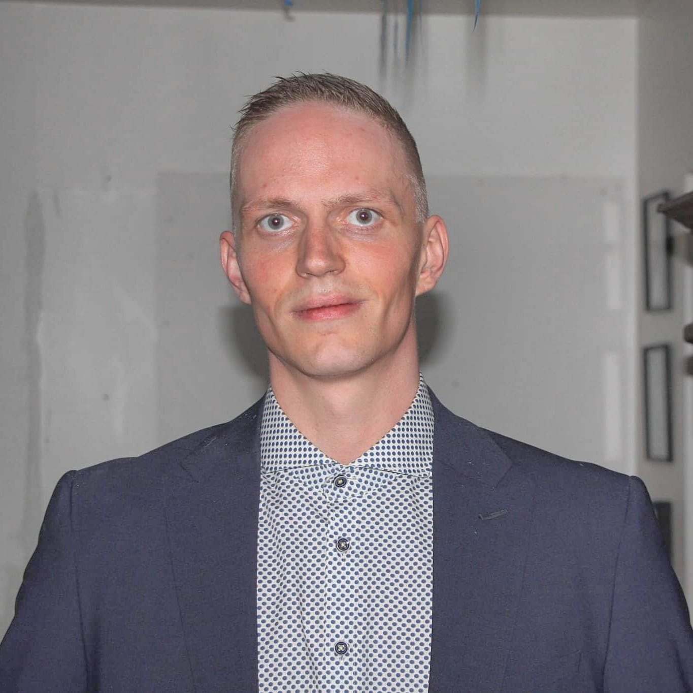

#


<hr>


### Hver er ég?

<div class="pull-left">
Jón Ingi heiti ég og er kennari á vegum [Omniglot AB](https://www.omniglot.se/) og kenni íslensku sem móðurmál fyrir nemendur á öllum grunnskólastigum. 

Sjálfur er ég nemi við Stokkhólmsháskóla, n.tt. í framhaldsnámi í sálfræði.

Hægt er að hafa samband við mig í gegnum netfangið <jon.ingi.hlynsson@gmail.com>
</div>


<div class="pull-right">
```{r, echo=FALSE, fig.align='right', out.width="30%"}

```
</div>

<br><br><br><br><br><br><br><br><br><br><br><br><br>
<hr>

### Móðurmálskennsla

Þessi vefsíða er ætluð nemendum í íslenskri móðurmálskennslu.

Öll börn í grunnskóla eiga rétt á móðurmálskennslu skv. lögum og reglum í Svíþjóð. 


<hr>


### Project Hlynsson má einnig finna á **YouTube**!

Á [**YouTube** rásinni minni](https://www.youtube.com/channel/UC8KVPSlpugcmWHFQYSAD4eA) má finna ýmis myndbönd á íslensku. Athugaðu þó að um eru að ræða myndbönd sem að mestu urðu til í tengslum við nám mitt við Háskóla Íslands.


<div class="pull-right">
{width=150px align="right"}
</div>
<br><br><br><br><br><br><br><br>


<br><br><br><br><br><br><br><br>
<hr>
`r r2symbols::symbol("copyright")` Jon Ingi Hlynsson - Síðasta breyting átti sér stað: `r Sys.Date()`