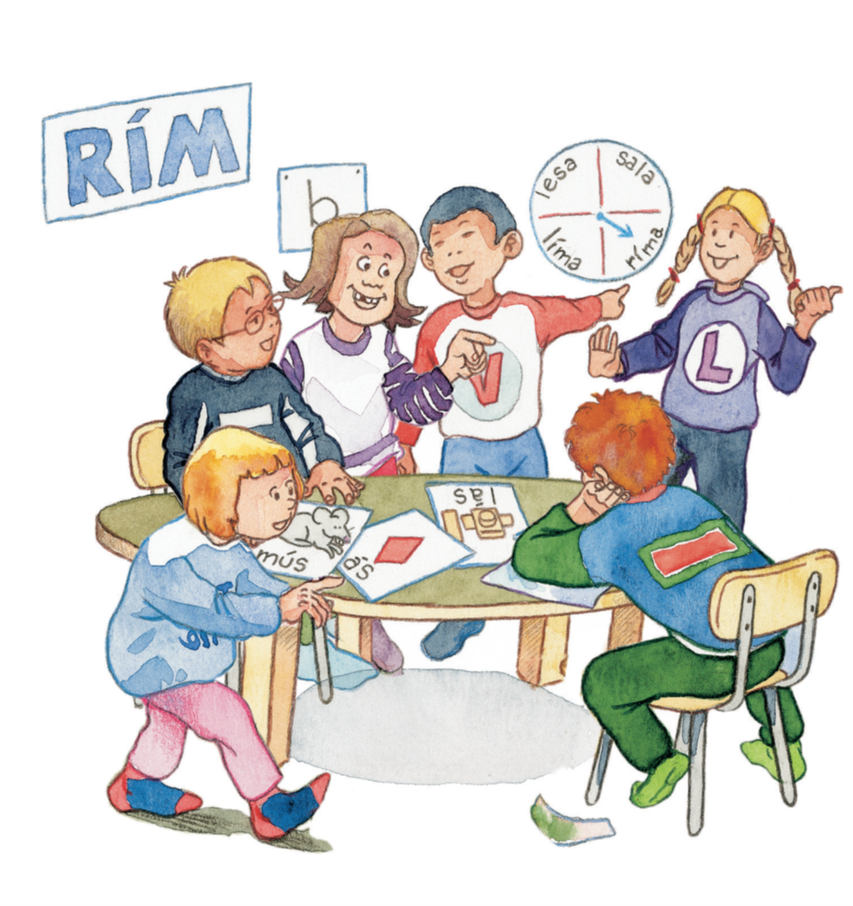

```{r setup, include=FALSE, warning=F}
options(htmltools.dir.version = FALSE)
library(kableExtra)
knitr::opts_chunk$set(
  # fig.width=9, fig.height=6, fig.retina=3, dpi = 150,
  # out.width = "150%",
  cache = FALSE,
  echo = FALSE,
  message = FALSE, 
  warning = FALSE,
  hiline = TRUE
)
```

```{r xaringan-themer, include=FALSE, warning=FALSE}
library(xaringanthemer)
style_duo_accent(
  primary_color = "#1381B0",
  secondary_color = "#FF961C",
  inverse_header_color = "#FFFFFF",
  inverse_background_color = "#4c516d"
)
```

class: center, middle
background-image: url(images/Omniglot-logo.png)
background-size: 125px
background-position: 5% 92%


# Bókin *Í vali*

### Móðurmálskennsla

Jón Ingi Hlynsson


#### Omniglot AB 

#### Glærum síðast breytt: `r Sys.Date()`

---


## Í dag ætlum við að skoða bókina *Í vali*  

--

```{r, out.width="30%"}

```

--

### Við ætlum líka að skoða *nýja **verkefnabók***

--

Í lok tímans ætlum við svo að skoða [stafaleik Búa](https://vefir.mms.is/bui/index.html)
---


```{r}
knitr::include_app("https://drive.google.com/file/d/1Ff6-l9ubrer1cnPdamYb15Agcb_wogBD/preview", height = 600)
```


---
class: center, middle


# Skoðum nú verkefnabókina!


---
class: center


# Stafaleikir Búa

```{r, echo=F, out.width="50%"}
knitr::include_graphics("images/stafaleikur-búi.png")
```

[Smelltu hér](https://vefir.mms.is/bui/index.html) til að opna stafaleikinn!