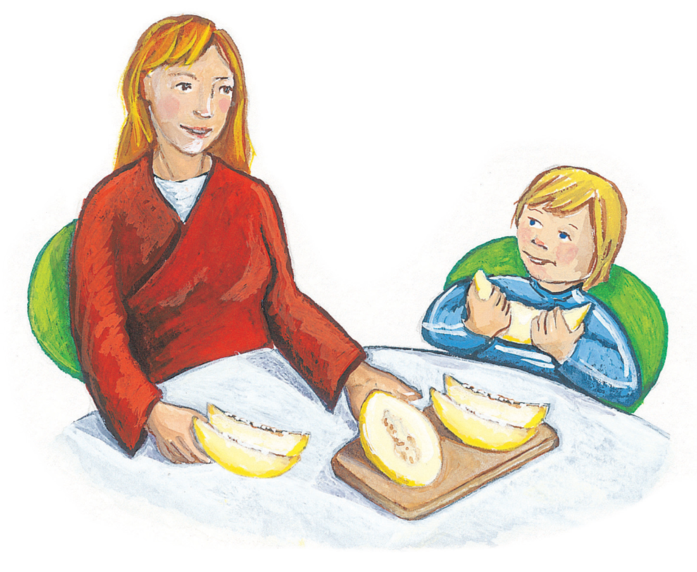
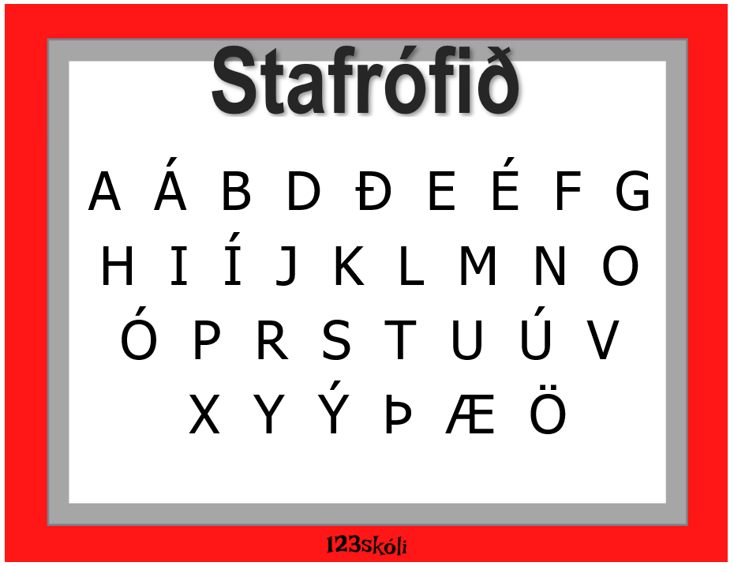

```{r setup, include=FALSE, warning=F}
options(htmltools.dir.version = FALSE)
library(kableExtra)
knitr::opts_chunk$set(
  # fig.width=9, fig.height=6, fig.retina=3, dpi = 150,
  # out.width = "150%",
  cache = FALSE,
  echo = FALSE,
  message = FALSE, 
  warning = FALSE,
  hiline = TRUE
)
```

```{r xaringan-themer, include=FALSE, warning=FALSE}
library(xaringanthemer)
style_duo_accent(
  primary_color = "#1381B0",
  secondary_color = "#FF961C",
  inverse_header_color = "#FFFFFF",
  inverse_background_color = "#4c516d"
)
```

class: center, middle
background-image: url(images/Omniglot-logo.png)
background-size: 125px
background-position: 5% 92%


# Bókin *Melóna*

### Móðurmálskennsla

Jón Ingi Hlynsson


#### Omniglot AB 

#### Glærum síðast breytt: `r Sys.Date()`

---


## Í dag ætlum við að skoða bókina *Melóna*  

--
```{r, out.width="20%"}

```

--
### Við ætlum líka að skoða *nýja **verkefnabók***

--
Og við ætlum líka að skoða **íslenska stafrófið** aftur!  

--
Í lok tímans, *ef tími gefst*, ætlum við svo að skoða [stafaleik Bínu](https://vefir.mms.is/bina/)

---

# Byrjum á að skoða íslenska stafrófið

.pull-left[
Íslensk stafrófsvísa

A, á, b, d, ð, e, é,  
f, g, h, i, í, j, k.  
L, m, n, o, ó og p  
eiga þar að standa hjá.  
R, s, t, u, ú, v næst,  
x, y, ý, svo þ, æ, ö.  
Íslenskt stafróf er hér læst  
í erindi þessi skrítin tvö.  


(*Þórarinn Eldjárn*)
]

.pull-right[
```{r}

```

]
---

# Byrjum á að skoða íslenska stafrófið

.pull-left[
Íslensk stafrófsvísa

A, á, b, d, ð, e, é,  
f, g, h, i, í, j, k.  
L, m, n, o, ó og p  
eiga þar að standa hjá.  
R, s, t, u, ú, v næst,  
x, y, ý, svo þ, æ, ö.  
Íslenskt stafróf er hér læst  
í erindi þessi skrítin tvö.  


(*Þórarinn Eldjárn*)
]

.pull-right[
<iframe width="560" height="315" src="https://www.youtube.com/embed/lYiqc0cqrnM?start=10" title="YouTube video player" frameborder="0" allow="accelerometer; autoplay; clipboard-write; encrypted-media; gyroscope; picture-in-picture" allowfullscreen></iframe>
]


---


```{r}
knitr::include_app("https://drive.google.com/file/d/1U4_HI8RBpkdsZpRfLthNVvV2zv6ipc07/preview", height = 600)
```


---
class: center, middle


# Skoðum nú verkefnabókina!


---
class: center


# Stafaleikir Bínu

```{r, echo=F, out.width="50%"}
knitr::include_graphics("images/stafaleikur-bína.png")
```

[Smelltu hér](https://vefir.mms.is/bina/) til að opna stafaleikinn!