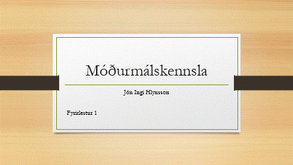
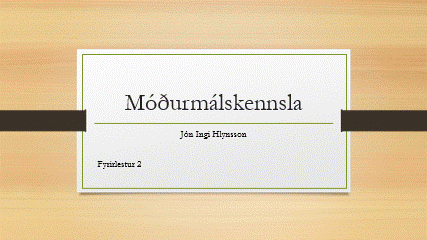
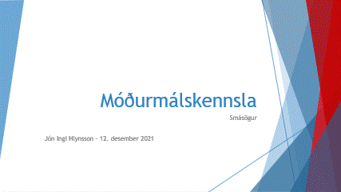
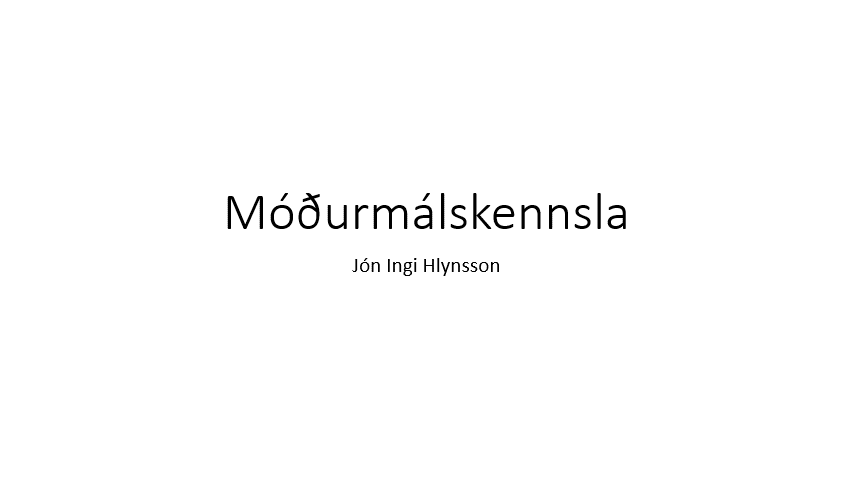

Hér má finna glærukynningar frá árinu 2021. Í framtíðinni koma glærurnar til með að vera með öðru sniði (sjá t.d. [**Laxdælu glærur**](laxdæla-glærur-1.html).)

## Glærur fyrir nemendur í 4-9 bekk

### Upphaf annarinnar

:::::{.center}

:::::

### Farið yfir áætlun vetrarins og ljóð kynnt í fyrsta skipti fyrir nemendum

:::::{.center}

:::::

### Hvað eru íslendingar að gera í loftslagsmálum?

<iframe src="https://drive.google.com/file/d/11GI5MJSVW3cCeG6lt_HzrRKprcNTPfgh/preview" width="640" height="480" allow="autoplay"></iframe>

### Orðflokkagreining

:::::{.center}

:::::

[**Smelltu hér**](orðflokkagreining.html) til að skoða glósur um orðflokkagreiningu.

### Uppruni tegundanna

<iframe src="https://drive.google.com/file/d/11KbZxkQDWtp6M5cXYPUhc3QEj-GM_IeA/preview" width="640" height="480" allow="autoplay"></iframe>

[**Smelltu hér**](TextiUmDarwin.html) til þess að skoða textan sem var lesinn í tíma.

### Hvað eru ljóð og hvernig skrifum við þau?

:::::{.center}

:::::

### Hvernig skrifum við smásögur?

:::::{.center}

:::::

## Glærur fyrir nemendur í 1-3 bekk

### Bókin *Í sól* 

:::::{.center}

:::::

### Bókin *Sólaás 7*

:::::{.center}

:::::
