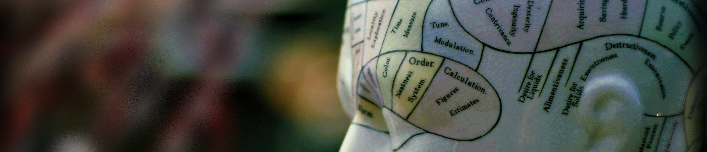

<!-- Global site tag (gtag.js) - Google Analytics -->
<script async src="https://www.googletagmanager.com/gtag/js?id=G-YREZ4RHVM6"></script>
<script>
  window.dataLayer = window.dataLayer || [];
  function gtag(){dataLayer.push(arguments);}
  gtag('js', new Date());

  gtag('config', 'G-YREZ4RHVM6');
</script>




Glærurnar á þessari síðu styðjast við opin aðgang Menntamálastofnunar á ýmiskonar námsefni [@Menntamalastofnun2016].

# 4-9 bekkur - glærupakkar

## [Fyrsti tíminn](first2022.html)

```{r, echo=F}
xaringanExtra::embed_xaringan("first2022.html")
```


## [Röksemdafærlsur](rok.html)[^1]

```{r, echo=F}
xaringanExtra::embed_xaringan("rok.html")
```

[^1]: Stuðst var við glærur úr áfanganum **Skýringar á hegðun** - Sigurður J. Grétarsson (2018) - við gerð þessa glæra. Efnið er aðgengilegt á netinu ef leitað er eftir heiti áfangans. Allur höfundaréttur í gróðaskyni liggur hjá Háskóla Íslands og Sigurði. Efnið er birt á þessari síðu með það að leiðarljósi að kynna rökfræði fyrir grunnskólanemum en *ekki* í ágóðaskyni. 

## [Röksemdafærlsur](rok2.html)[^1]

```{r, echo=F}
xaringanExtra::embed_xaringan("rok2.html")
```

## [Þjálfun í ritun](ritun20220927.html)

```{r, echo=F}
xaringanExtra::embed_xaringan("ritun20220927.html")
```

## [Þjálfun í ritun - seinni tími](ritun20221011.html)[^2]

[^2]: [**Smelltu hér**](https://drive.google.com/file/d/1qe-0h1XX5wwkCJDRyraNFtM_vzkXfnbG/view) til þess að skoða glærur á sænsku um fimm-þátta persónuleikalíkanið

```{r, echo=F}
xaringanExtra::embed_xaringan("ritun20221011.html")
```

## [Ritgerðasmíði](ritgerd1.html)

```{r, echo=F}
xaringanExtra::embed_xaringan("ritgerd1.html")
```

## [Íslensk kennileiti](kennileiti.html)

```{r, echo=F}
xaringanExtra::embed_xaringan("kennileiti.html")
```

## [Íslensk kennileiti - lokatími](kennileitiFinal.html)

```{r, echo=F}
xaringanExtra::embed_xaringan("kennileitiFinal.html")
```


## [Höfuðborgarsvæðið](hofudborgin.html)

```{r, echo=F}
xaringanExtra::embed_xaringan("hofudborgin.html")
```


<br><br><br><br><br><br><br><br>

# Heimildir 
<div id="refs"></div>

<hr>
`r r2symbols::symbol("copyright")` Jon Ingi Hlynsson - Síðasta breyting átti sér stað: `r Sys.Date()`