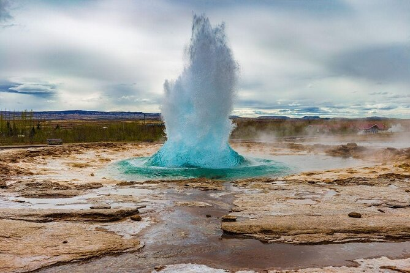

```{r setup, include=FALSE}
options(htmltools.dir.version = FALSE)
library(kableExtra)
knitr::opts_chunk$set(
  cache = FALSE,
  echo = FALSE,
  message = FALSE, 
  warning = FALSE,
  hiline = TRUE
)
```

```{r xaringan-themer, include=FALSE, warning=FALSE}
library(xaringanthemer)
style_duo_accent(
  primary_color = "#1381B0",
  secondary_color = "#FF961C",
  inverse_header_color = "#FFFFFF",
  inverse_background_color = "#4c516d", 
  colors = c(red = "#ff0019", black = "#000000"), inverse_text_color = "#FFFFFF"
)

library(xaringanExtra)
use_tile_view()
```

class: center, middle
background-image: url(images/Omniglot-logo.png)
background-size: 125px
background-position: 5% 92%

# Íslensk kennileiti

### Móðurmálskennsla


Jón Ingi Hlynsson


#### Omniglot AB 

#### Vorönn 2023

---
class: center middle inverse

### Textasmíði er skipulögð hugsun


Að vera fær í að skrifa eflir getu okkar til þess að hugsa


---

# Heimanám

--

Hvað gerðir þú heima sl. tvær vikur?

--

Við töluðum um:  
- Lestur í kjörbók
- Markmiðasetningu


---

# Kjörbók


---


# Næstu tímar


- Ritunartímar (uppbygging): 
  - Stutt umfjöllun um ýmis íslensk kennileiti (eitt í hverjum tíma) 
  - Sjálfstæð öflun upplýsinga (t.d. Google og Wikipedia) um það kennileiti sem grundvallar tímann
  - Ritun knappra textabrota
    - Skila í lok tímans
  
--


Hugmyndin er svo að tvinna saman textana:

- Rauði þráðurinn = íslensk kennileiti

---

# Gullfoss


.pull-left[
[Gullfoss](https://is.wikipedia.org/wiki/Gullfoss) er foss í Hvítá upp af Haukadal í Árnessýslu.


Gullfoss og landið meðfram Hvítá **friðlýst** árið 1979.


Gullfoss er í raun **tveir fossar**, efri fossinn er 11 metrar og neðri fossinn 20 metrar.

**Einn vinsælasti ferðamannastaður Íslands.**

]

.pull-right[
```{r, out.width="80%", fig.align='right'}

```

]


???


https://ust.is/nattura/natturuverndarsvaedi/fridlyst-svaedi/sudurland/gullfoss/

---

# Gullfoss


.pull-left[
[Gullfoss](https://is.wikipedia.org/wiki/Gullfoss) er foss í Hvítá upp af Haukadal í Árnessýslu.


Gullfoss og landið meðfram Hvítá **friðlýst** árið 1979.


Gullfoss er í raun **tveir fossar**, efri fossinn er 11 metrar og neðri fossinn 20 metrar.

Eftirfarandi reglur gilda um friðlandið:  
- Mannvirkjagerð og jarðrask og aðrar breytingar á svæðinu eru óheimilar án leyfis.
- Gangandi fólki er heimil för um svæðið, enda sé góðrar umgengni gætt.
- Akstur utan vega og merktra ökuslóða er óheimill.
- Bannað er að skerða gróður, trufla dýralíf og skemma jarðmyndanir.
- Notkun flygildis (dróna) er óheimil nema með leyfi Umhverfisstofnunar.

]

.pull-right[
```{r, out.width="80%", fig.align='right'}

```

]


???


https://ust.is/nattura/natturuverndarsvaedi/fridlyst-svaedi/sudurland/gullfoss/

---

# Ritun og sjálfstæð öflun upplýsinga

Rita stuttan texta um Gullfoss sem byggir á glærunum hér á undan, umræðu okkar og sjálfstæðri upplýsingaöflun. 

Skoðaðu heimildir (þ.e. vefsíður) og dragðu út aðalatriðin í samfelldan og sjálfstæðan texta.

- Afritaðu og límdu inn neðst hlekki að þeim vefsíðum sem þú notast við


---


# Geysir

.pull-left[
[Geysir](https://is.wikipedia.org/wiki/Geysir) í Haukadal er goshver sem nú til dags lætur lítið á sér **kræla**. 

Geysir er einn frægasti goshver í heimi. 

Margir fleiri hverir eru á Geysissvæðinu, til dæmis Strokkur, Smiður og Litli-Strokkur.

[Hverasvæðið var friðlýst 17. júní 2020.](https://www.frettabladid.is/frettir/geysir-fridlystur-a-17-juni/)

>Geysis er fyrst getið með nafni árið 1647 og er þá mikill og ákafur goshver, en á þeim tímum gat hann gosið nokkuð reglulega. Þá þeyttu hann vatni 60 til 80 metra upp í loftið. Fyrir árið 1845 varð hann allt að 170 metrar. Eftir árið 1900 dró mikið úr gosvirkni hans og var kólnunarflötur vatnsins (yfirborðið) orðið of stórt.

]

.pull-right[
```{r, out.width="80%", fig.align='right'}

```

]

???
https://timarit.is/page/3305804#page/n5/mode/2up
https://timarit.is/page/1228975#page/n2/mode/2up

---

# Ritun og sjálfstæð öflun upplýsinga

Rita stuttan texta um Geysi sem byggir á glærunum hér á undan, umræðu okkar og sjálfstæðri upplýsingaöflun. 

Skoðaðu heimildir (þ.e. vefsíður) og dragðu út aðalatriðin í samfelldan og sjálfstæðan texta.

- Afritaðu og límdu inn neðst hlekki að þeim vefsíðum sem þú notast við

---

# Þingvellir 


.pull-left[
[Þingvellir](https://is.wikipedia.org/wiki/%C3%9Eingvellir) eru flatir, grasi grónir vellir norðan við Þingvallavatn á bökkum Öxarár, sem rennur eftir völlunum út í Þingvallavatn, sem er stærsta náttúrulega stöðuvatn á Íslandi. 

Þjóðgarður var stofnaður árið 1928 og nær hann yfir Þingvelli og nánasta umhverfi þeirra.

[**Alþingi**](https://www.thingvellir.is/fraedsla/saga/loegberg/) var stofnað á Þingvöllum árið 930 og kom þar saman árlega allt fram til ársins 1798.

Lög um friðun Þingvalla kváðu á um að [frá ársbyrjun 1930 skulu Þingvellir við Öxará og grenndin þar vera friðlýstur helgistaður allra Íslendinga](https://www.althingi.is/lagas/130a/1928059.html).
]

.pull-right[
```{r, out.width="80%", fig.align='right'}
knitr::include_graphics("images/Kennileiti/þingvellir.jpg")
```

]

---

# Ritun og sjálfstæð öflun upplýsinga

Rita stuttan texta um Þingvelli sem byggir á glærunum hér á undan, umræðu okkar og sjálfstæðri upplýsingaöflun. 

Skoðaðu heimildir (þ.e. vefsíður) og dragðu út aðalatriðin í samfelldan og sjálfstæðan texta.

- Afritaðu og límdu inn neðst hlekki að þeim vefsíðum sem þú notast við

---

# Gullni hringurinn (Gullfoss, Geysir og Þingvellir)

Í síðustu tímum höfum við kynnt okkur hvort fyrir sig. Núna ætlum við að útbúa einskonar útdrátt sem dregur aðalatriði hvers texta saman.  
  
  
  


> Ferðamenn og heimamenn sömuleiðis keppast við að fara hinn svokallaða *gullna hring*. Slíkur leiðangur samanstendur af leiðangri að Geysi, Gullfoss og í Þingvallaþjóðgarð. Ef til vill væri gaman að byrja á að skoða hið heimsfræga jarðhitasvæði Geysis. Þar er að finna bullandi hveri og þar á meðal virkasta hver Íslands, **Strokk**. Eftir þægilegt stopp þar er síðan sniðugt að halda áleiðis til Gullfoss en hann er einhver nafntogaðasti foss Íslands fyrir ógnarmátt sinn og fegurð. Við Gullfoss á maður kost á því að standa við hlið eins vatnsmesta foss Evrópu og sjá gífurlegt magn af vatni steypast ofan í tilkomumikið gil. Gullni hringurinn klárast svo með heimsókn í Þingvallaþjóðgarð en það er það svæði okkar Íslendinga sem hefur hvað mesta sögulega og jarðfræðilega þýðingu.


???
https://www.re.is/is/tour/golden-circle-direct/

---

# Heimanám

- **Lesa í kjörbók**!


---
class: center middle inverse


# Takk fyrir tímann!
