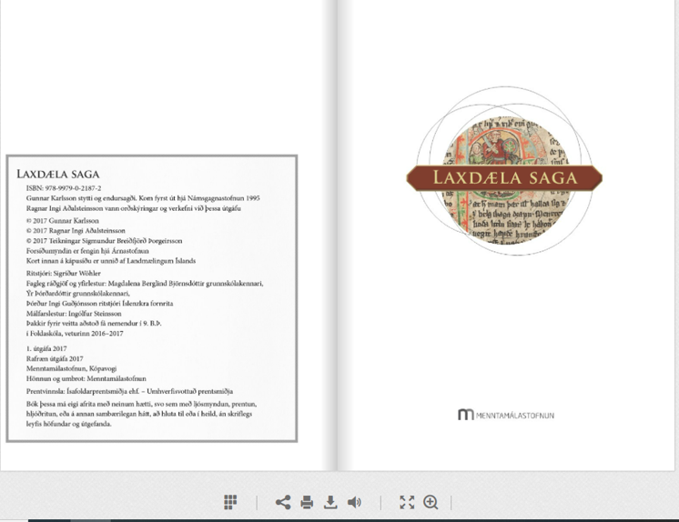
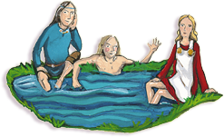

```{r setup, include=FALSE}
options(htmltools.dir.version = FALSE)
library(kableExtra)
knitr::opts_chunk$set(
  cache = FALSE,
  echo = TRUE,
  message = FALSE, 
  warning = FALSE,
  hiline = TRUE
)
```

```{r xaringan-themer, include=FALSE, warning=FALSE}
library(xaringanthemer)
style_duo_accent(
  primary_color = "#1381B0",
  secondary_color = "#FF961C",
  inverse_header_color = "#FFFFFF",
  inverse_background_color = "#4c516d", 
  colors = c(red = "#ff0019", black = "#000000"), inverse_text_color = "#FFFFFF"
)

library(xaringanExtra)
use_tile_view()
```

class: center, middle
background-image: url(images/Omniglot-logo.png)
background-size: 125px
background-position: 5% 92%

# Laxdæla - tími 1

### Móðurmálskennsla

Jón Ingi Hlynsson


#### Omniglot AB 

#### Glærum síðast breytt: `r Sys.Date()`

---


# Forsaga

## Um Laxdælu

Sennilega skrifuð um miðja 13. öld
Höfundur óþekktur

Við finnum bókina á slóðinni: https://vefir.mms.is/flettibaekur/namsefni/LAXDAELAsaga/

Eða með því að leita eftir „Laxdæla mms“ á Google


---


## Sækjum bókina

Hún lýtur svona út:

.pull-right[

]


---


## Um laxdælu frh.

.pull-left[
Gerist á landnámsöld

Sagan hefst u.þ.b. árið 870

Laxdæla er allt í senn:

- Héraðssaga
- Ættarsaga 
- Ástarsaga

]

<br><br><br><br><br><br><br><br><br><br>
.pull-right[
```{r, echo=F, fig.align='right', out.width="50%"}

```


]


---


# Varðveisla 

--


Laxdæla saga er varðveitt í heild í Möðruvallabók, handriti frá fyrri hluta 14.
aldar, en brot af henni eru í fleiri skinnhandritum og sagan öll í ungum pappírshandritum.


--


## Ritunartími

--

Annars vegar getur sagan varla verið eldri en frá um 1230.


???

Áhrif riddarasagna: Í sögunni eru greinileg áhrif frá riddarasögum og riddaramenningu
sunnan úr Evrópu. Þar eru glæsilegir búningar og skart, málaðir
og gylltir skildir og söðlar. Að minnsta kosti eitt atriði virðist sótt til riddarasagna, og er þess getið við 31. kafla hér á eftir. Ekki er vitað til að franskar riddarasögur hafi verið þýddar á norrænu fyrr en árið 1226, og almennt jukust áhrif suðrænnar aðalsmenningar í Noregi á valdatíma Hákonar konungs
Hákonarsonar, 1217–63.


--

Hins vegar bendir annað til að sagan sé ekki yngri en frá miðri öldinni.


???

Skírslur í gildi: Í 18.kafla sögunnar sjálfrar (ekki í endursögninni) segir frá því
að maður gerir skírslu til að sanna vitnisburð sem skiptir máli í erfðadeilu. Því
fylgir athugasemd í sögunni: „Ekki þóttust heiðnir menn minna eiga í ábyrgð,
þá er slíka hluti skyldi fremja, en nú þykjast eiga kristnir menn, þá er skírslur
eru gervar.“ Nú vill svo til að Vilhjálmur kardináli af Sabina bannaði skírslur
og guðsdóma í Noregi, þegar hann kom þangað til að krýna Hákon konung
árið 1247. Árið eftir er talað um „boðorða breytni“ í íslenskum annálum, og
er sennilegt að þar sé vísað til boðorða kardinála. Einar Ól. Sveinsson telur að
höfundur Laxdælu hafi fylgst svo vel með að hann hefði tekið öðruvísi til orða
um skírslur ef hann hefði ekki verið búinn að skrifa þennan hluta sögunnar
fyrir 1248.

**Aldur handrita**: Elsta handritsbrot sögunnar, AM 162 D2, fol., er talið vera frá
síðari hluta 13. aldar, og önnur brot eru tímasett um 1300.


---


.center[
## Forþekking
]


Eftirfarandi fullyrðingar eru ýmist sannar eða ósannar:
- Víkingar rændu og rupluðu.
- Víkingar sigldu á víkingaskipum milli landa.
- Víkingar voru miklir bardagamenn.
- Víkingar báru hjálma með hornum, á höfðinu.
- Trú víkinga kvað á um að þeir færu til Valhallar, paradísar víkinga, skyldu þeir deyja í bardaga.


---


.center[
## Forþekking
]


Eftirfarandi fullyrðingar eru ýmist sannar eða ósannar:
- Víkingar rændu og rupluðu.
- Víkingar sigldu á víkingaskipum milli landa.
- Víkingar voru miklir bardagamenn.
- **.red[Víkingar báru hjálma með hornum, á höfðinu.]**
- Trú víkinga kvað á um að þeir færu til Valhallar, paradísar víkinga, skyldu þeir deyja í bardaga.


???

Aðeins rauðlitaða setningin er röng


---
class: inverse
background-image: url(images/Laxdæla/viking.png)
background-size: 1350px


.center[
## Að fara í víking
]

- Ungir menn
- Ekki konur
  - Jafnan á sumrin, sbr. veðurfari

--

**Markið**: að reyna á ungu mennina – *manndómsvígsla*

--

Orðið víkingur merkti upphaflega sjóræningi og var notað um norræna karlmenn sem sigldu í ránsferðir.

--

Orðið útrásarvíkingar á uppruna sinn í þessu orðasambandi


---
class: inverse
background-image: url(images/Laxdæla/viking.png)
background-size: 1350px


.center[
## Að fara í víking
]

Munum eftir Agli Skalla-Grímssyni og ljóðinu sem móðir hans orti:

.pull-left[
Það mælti mín móðir,<br>
að mér skyldi kaupa<br>
fley og fagrar árar,<br>
fara á brott með víkingum,<br>
standa upp í stafni,<br>
stýra dýrum knerri,<br>
halda svo til hafnar,<br>
höggva mann og annan.<br>
]

<br>

.pull-right[
<iframe id="ytplayer" type="text/html" width="720" height="405"
src="https://www.youtube.com/embed/A6K8pSjYu1w?autoplay=1&controls=0&enablejsapi=1&loop=1&modestbranding=1&iv_load_policy=3"
frameborder="0" allowfullscreen>
]


---
class: inverse
background-image: url(images/Laxdæla/viking.png)
background-size: 1350px


.center[
## Að fara í víking
]

.pull-left[
Sumar söguhetjur Íslendingasagnanna fara **í víking** en það kallaðist að fara í víking þegar menn sigldu í ránsferðir til annarra landa. 
]

.pull-right[
Heimildir frá öðrum löndum sýna að víkingarnir vöktu ótta því þeir voru herskáir, brenndu bæi, drápu fólk og rændu bæði fólki og fé. 
]


---
background-image: url(images/Laxdæla/daglegtlif.jpg)
background-size: 125px
background-position: 92% 5%


# Daglegt líf víkinga

Fólkið sem bjó á Íslandi á víkingaöld stundaði búskap, ræktaði korn og var með dýr. 

--

Ekkert rafmagn; ekkert rennandi vatn svo byrja þurfti hvern dag á að sækja vatn til drykkjar og matseldar. 

--

Allan mat þurfti að vinna frá grunni, slátra skepnum, verka kjötið, mjólka kýr o.s.frv. 

--

Fötin voru líka gerð „beint af kindinni“. Band var spunnið úr ullinni og úr því var ofið efni, svo kallað **vaðmál**, sem fötin voru saumuð úr. 

--

Allir á heimilinu hjálpuðust að; börn hlutverk við vinnuna um 7 ára gömul. 

--

Mesta vinnan inni á heimilunum hvíldi þó á herðum kvenna: 

--


- Þær sáu um matinn og bjuggu til klæðnaðinn. 


--


- Þær hugsuðu líka um alla sem gátu ekki bjargað sér sjálfir; börn, sjúklinga, fatlað fólk og gamalmenni.


---


.center[
# Skriflegt tímaverkefni
]


.center[Um víkinga (á landnámsöld):]

<br><br><br>
1. Hvað eru víkingar?
1. Hvað heldur þú að hafi reynst **auðveldast** fyrir daglegt líf víkinga?
1. Hvað heldur þú að hafi reynst **erfiðast** fyrir daglegt líf víkinga?
1. Hvað telur þú hafa verið **gott/jákvætt** við daglegt líf víkinga?
1. Hvað telur þú hafa verið **slæmt/neikvætt** við daglegt líf víkinga?


---


# Næstu tímar og heimaverkefni þar af lútandi

.pull-left[
Í Laxdælu er 34 kaflar (ath. þeirri útgáfu sem við munum lesa)

Við munum skipta bókinni í þrjá hluta:

- Kafla 1-11
- Kafla: 12-23
- Kafla: 24-34

Í kennslustundum munum við síðan ræða og fara yfir lesturinn (með verkefnum)
]

<br><br><br><br><br><br><br><br><br><br>
.pull-right[
```{r, echo=F, out.width="60%", fig.align='right'}
knitr::include_graphics("images/Laxdæla/kaflaskipting.png")
```
]


---


.center[
# Hafa í huga!
]

Í næstu kennslustundum geta verkefni eða próf úr bókinni dokað upp

Þau munu byggja á þeim heimalestri sem hefur þegar átt sér stað

- Dæmi: í næsta tíma eru kaflar 1-11 undir; í þarnæsta tíma eru kaflar 1-23 undir; í síðasta tímanum er öll bókin undir (kaflar 1-34).
- Með öðrum orðum: eftir því sem við lesum okkur lengra inn í bókina geri ég ráð fyrir því að það sem hafi þegar verið lesið sé mögulegt verkefnaefni/prófefni

**Hins vegar**: þeir kaflar sem ríma við viðeigandi tíma eru í forgrunni!

- Hafðu þó í huga að verkefni eða próf úr allri bókinni gæti dokað upp í síðasta tímanum


---


.center[
# Ráðleggingar og fl.
]

Í bókinni finnast verkefni sem hægt er að vinna eftir hvern kafla

Þau eru vel til þess fallin að auka skilning á efni bókarinnar 

Ég legg **ekki** áherslu á að þessi verkefni séu unnin heima *en hafðu í huga að eitthvert þeirra gæti dokað upp í formi **verkefnis eða prófs** í kennslustund*. 

Fyrir vikið hámarkar þú möguleika þína á því að skara fram úr með því að vinna verkefnin samhliða lestrinum. **Það er þó valfrjálst**.


--


Ég mæli með að skrifa niður (glósa) samhliða lestri:

- Um hvað var kaflinn í 1-3 setningum eftir hvern kafla	
- Spurningar sem vakna við lesturinn og taka með í kennslustund svo að við getum rætt þær


---


# Fyrir næsta tíma

.pull-left[
**.black[Lesa kafla 1-11]**
]

.pull-right[
```{r, echo=FALSE, fig.align='right', out.width="50%"}
knitr::include_graphics("images/Laxdæla/efnisyfirlit.png")
```
]


---


# Fyrir næsta tíma

.pull-left[
**.black[Lesa kafla 1-11]**


Gangi þér vel að lesa! (eða hlusta)
]

.pull-right[
```{r, echo=FALSE, fig.align='right', out.width="50%"}
knitr::include_graphics("images/Laxdæla/efnisyfirlit.png")
```
]


---
class: center, middle, inverse 


# Takk fyrir tímann í dag!

