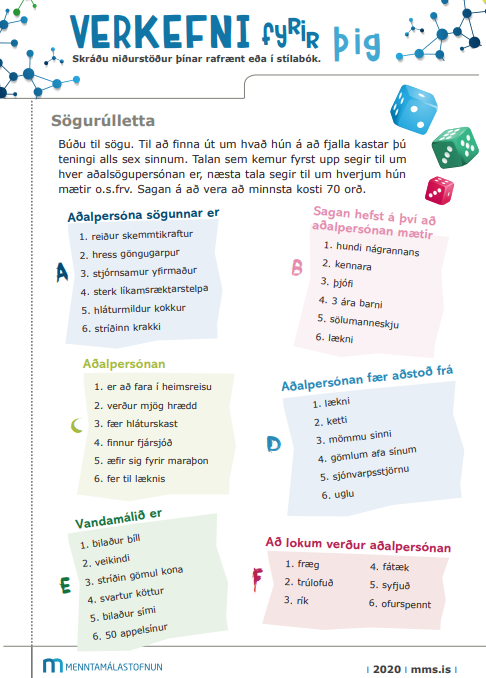

```{r setup, include=FALSE}
options(htmltools.dir.version = FALSE)
library(kableExtra)
knitr::opts_chunk$set(
  cache = FALSE,
  echo = FALSE,
  message = FALSE, 
  warning = FALSE,
  hiline = TRUE
)
```

```{r xaringan-themer, include=FALSE, warning=FALSE}
library(xaringanthemer)
style_duo_accent(
  primary_color = "#1381B0",
  secondary_color = "#FF961C",
  inverse_header_color = "#FFFFFF",
  inverse_background_color = "#4c516d", 
  colors = c(red = "#ff0019", black = "#000000"), inverse_text_color = "#FFFFFF"
)

library(xaringanExtra)
use_tile_view()
```

class: center, middle
background-image: url(images/Omniglot-logo.png)
background-size: 125px
background-position: 5% 92%

# Ritun

### Móðurmálskennsla


Jón Ingi Hlynsson


#### Omniglot AB 

#### Glærum síðast breytt: `r Sys.Date()`

---
class: center middle inverse

### Textasmíði er skipulögð hugsun


Að vera fær í að skrifa eflir getu okkar til þess að hugsa


---
class: center

# Athuga

## Það er **ekki** íslenska í næstu viku (n.tt. 4. okt)


---

# Heimanám

--

Hvað gerðir þú heima í vikunni?

--

Við töluðum um:  
- Lestur í kjörbók
- Texti um kosti og galla þess að færa klukkuna til á sumrin
- Finna up á nýjum dæmum fyrir 5 rökvillur
- **Lús**lesa 1. kafla í bókinni Neistar

--

**Þetta er svolítið mikið**!  

--
En munum að þetta er það sem er búið að safnast upp

--

Förum yfir textana (með og á móti breytingu klukkunnar) frá því í þarsíðustu viku

--

Skoðum tímaverkefnið frá því í síðustu viku

---

# Kjörbók

Segja mér frá einni sögu


---


# Í dag


Við ætlum að klára að: 

- þjálfa okkur í ritun 


--

**Afhverju er það sniðugt?**

--

Af því að ritun er skipulögð hugsun!


---

# Afhverju að skirfa?

.pull-left[
**Samfélagið krefst þess** að þú getir aflað þér upplýsinga, verið gagnrýnin(n) á þær og komið þeim frá þér, m.a. í rituðu máli.  

Þú **þjálfast í að vinna úr upplýsingum** – þegar þú skrifar texta þarftu að kynna þér málefni frá öllum hliðum á röklega máta, greina aðal- og aukaatriði og setja þau fram á skýran og skipulegan hátt.

Þú **eflir gagnrýna hugsun** – ritgerðasmíð og önnur ritun kallar oft á heimildavinnu og þú lærir og skilur betur að ekki er alltaf allt sem sýnist og að sumar heimildir eru öruggar á meðan aðrar eru óáreiðanlegar eða hreint og beint falskar (sbr. rökvillur).

]

.pull-right[
```{r, out.width="80%", fig.align='right'}
knitr::include_graphics("images/Ritun/ritun1.png")
```

]

---


# Afhverju að skrifa frh.

.pull-left[
Þú verður **betri í að standa fyrir máli þínu í daglegu lífi** – heimildavinna og almenn textasmíði felur í sér ákveðna rökleiðslu og samtal á milli ólíkra sjónarmiða. Ef þú þarft einhvern tímann að sannfæra einhvern (vinnuveitanda, vin, foreldri, þjónustufulltrúa) er mikilvægt að málflutningur þinn sé beinskeyttur og sannfærandi (þó einnig knappur) og ýmist byggður á traustum heimildum og/eða bjargföstum röksemdum.

]

.pull-right[
```{r, out.width="80%", fig.align='right'}
knitr::include_graphics("images/Ritun/ritun1.png")
```

]

---


# Afhverju að skrifa frh.

.pull-left[

Þú **eflist og eykur möguleika þína** – í upplýsingasamfélagi nútímans þar sem mikið magn af gögnum og heimildum er aðgengilegt öllum er mikilvægt fyrir hvern og einn að vera læs á gæði og áreiðanleika upplýsinga. Í framhaldsskóla og háskóla er gerð rík krafa um ritun, í mörgum starfsgreinum er það einnig gert og ef þú vilt starfa við ritun eða úrvinnslu texta (t.d. í sköpun, blaðamennsku eða fræðimennsku) er færni á þessu sviði alveg nauðsynleg.

]

.pull-right[
```{r, out.width="80%", fig.align='right'}
knitr::include_graphics("images/Ritun/ritun1.png")
```

]

---

.center[
.middle[# Tímaverkefni - Sögurúlletta]
]

.center[
.middle[
```{r, out.width="33%"}

```
]]

???
https://www.random.org/dice/


---

# Bókin *Neistar*

```{r}
knitr::include_app("https://drive.google.com/file/d/1Rndg_POAxbuuZrqKCpEpmkzKzQtYZgZg/preview", height = 200)
```

Fannst þér gagnlegt að skoða þessa bók?


--

Hvers vegna/hvers vegna ekki?

---

# Fyrir næsta tíma

- **Lesa í kjörbók**

**Heimaverkefni**:  
200 orða ***knappur texti*** um tilfinningar

Notaðu glærurnar frá því í fyrra þér til stuðnings

.pull-right[
```{r, fig.align='right'}
xaringanExtra::embed_xaringan("tilfinningar.html", max_width = 450)
```
]


--


---
class: center middle inverse


# Takk fyrir tímann!
