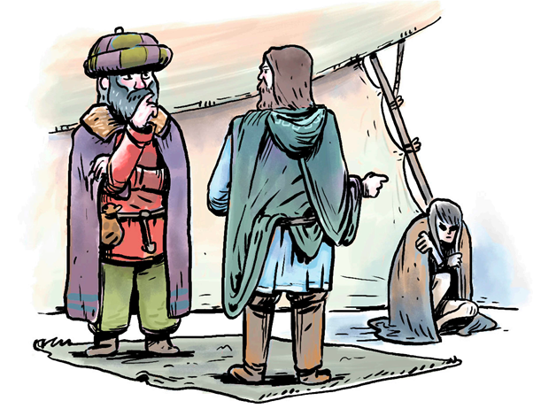
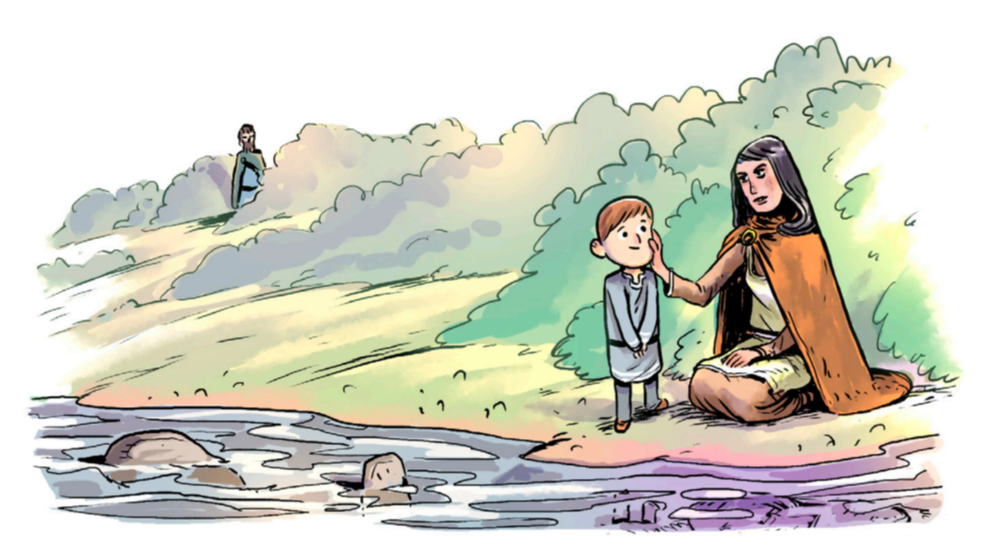
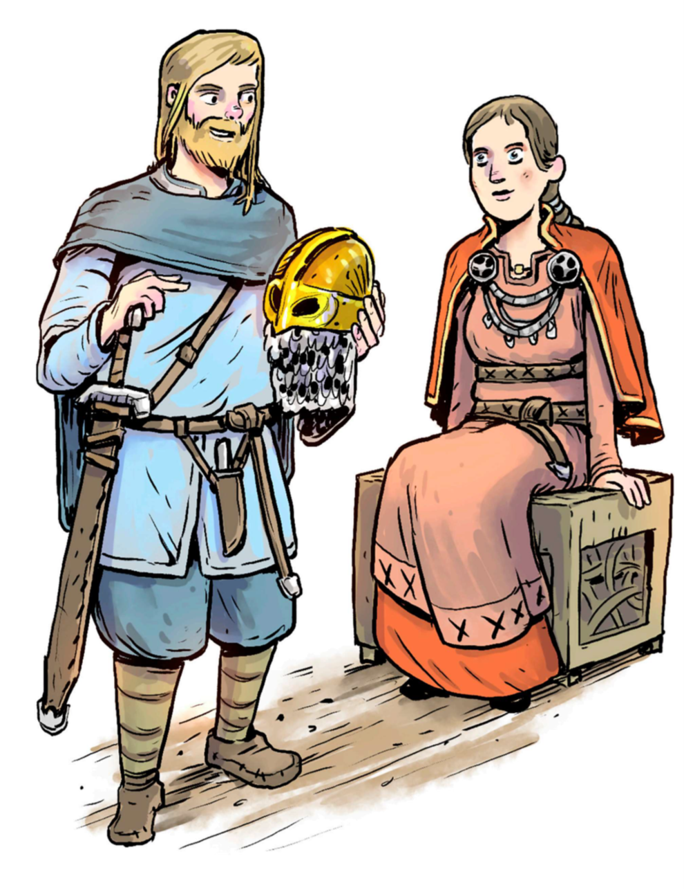
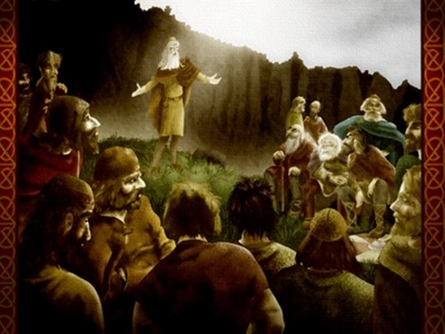
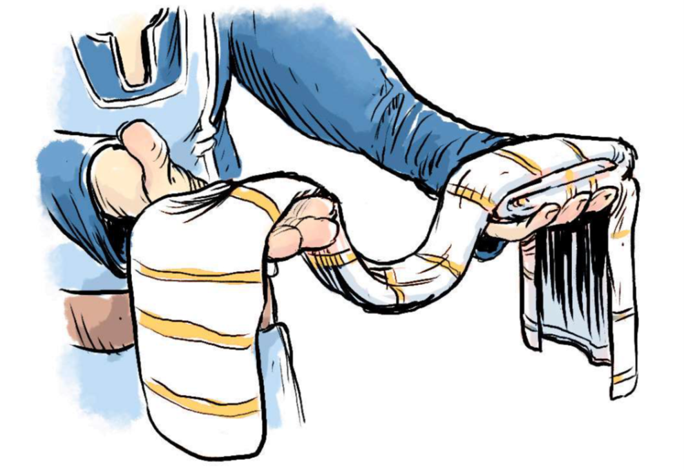

### Einfölduð útgáfa

Þetta skjal er tilraun mín til þess að einfalda málfar í bókinni @Laxdaela2017. Skjal þetta er skapað með það að leiðarljósi að gera söguna enn aðgengilegri en hún þegar er. 

**Yfirlýsing**: Texti þessi er ætlaður nemendum í íslenskri móðurmálskennslu og **ekki** ætlaður til dreifingar. Enn fremur er þessum texta **ekki** ætlað að skyggja á útgáfu bókarinnar sem aðgengileg er á vefsvæði Menntamálastofnunar. Allur höfundarréttur liggur hjá útgefanda bókarinnar en ekki hjá mér.

Kveðja, Jón Ingi Hlynsson

\newpage
# 1. Unnur djúpúgða

Ketill flatnefur var höfðingi í Noregi en þegar Haraldur konungur hárfagri tók yfir völd ákvað Ketill að flýja land með fjölskyldu sinni. Hann vildi nefnilega ekki verða undirmaður Haralds. 

Synir Ketils, Björn og Helgi, vildu flytja til Íslands. Þeir sögðu Katli (pabba sínum) að þar væri nóg af landi sem ekki þyrfti að kaupa. Enn fremur, að nóg væri um fisk á Íslandi. Hins vegar leist Katli illa á þessa tillögu þeirra og kvaðst^[sagðist] aldrei vilja koma þangað. Hann væri orðinn gamall.

Synir Ketils sigldu til Íslands. Björn settist að á Snæfellsnesi og kallaði bæ sinn Bjarnarhöfn en Helgi á Kjalarnesi og bjó á Esjubergi. 

Ketill fluttist til Skotlands og tók dóttur sína með sér. Dóttir Ketils hét Unnur og var kölluð Unnur **djúpúgða**^[djúpúgða merkir *hin vitra*].

Allt sama gerist þetta á **víkingaöld**^[víkingaöld er tímabil í sögu Norður-Evrópu frá 793-1066]. Þegar Ketill var drepinn ákvað Unnur að sigla til Íslands. Um það var talað að aldrei áður hefi kona náð að flýja frá sambærilegum aðstæðum með jafnmikið fé^[fjármuni/peninga/verðmæti] og margt fólk með sér og Unnur gerði þarna. Því er auðséð að Unnur hafi verið mikið afbragð annarra kvenna^[sérstök/einstök].

Fyrsta veturinn sinn á Íslandi dvaldi Unnur hjá Byrni bróður sínum, en Helgi hafði ekki viljað bjóða nema helmingnum af fólkinu sem Unnur var með sér að vera hjá sér. 

Vorið eftir fór Unnur vestur í Dali og nam þar land. Unnur byggði sér bæ í Hvammi en gaf ferðafélögum sínum land víða um Dali. Einn af ferðafélögum Unnar hét Kollur. Unnur átti son sem hét Þorsteinn og Þorsteinn átti dóttur sem hét Þorgerður. Þorgerður giftist Kolli og gaf Unnur þeim allan Laxárdal. Kollur var síðan kallaður Dala-Kollur.

Yngsti sonur Þosteins hét Ólafur **feilan**^[**feilan** merkir ylfingur, úlfshvolpur]. Hann bjó hjá Unni í Hvammi. Þegar Unnur var orðin gömul og lasburða af elli sagði hún við Ólaf að nú væri kominn tími fyrir hann að eignast konu^[giftast konu væri mögulega betra orðalag. Þetta er valið í samræmi við bókina @Laxdaela2017]. Síðan var fundin kona handa Ólafi og haldin brúðkaupsveisla. 

Allir skemmtu sér vel í veislunni og í henni tilkynnti Unnur að Ólafur skyldi nú fá að eiga bæ sinn á Hvammi með öllu sem því fygldi. Gestirnir höfðu orð á því að Unnur væri enn virðuleg.

Unnur hafði það fyrir venju að fara ekki á fætur fyrr en um miðjan dag. Daginn eftir veisluna svaf hún þó svo lengi að Ólafur ákvað að kíkja á hana en þá var hún dáin. 

Ólafur feilan tók við búi í Hvammi og bjó þar til elli.

\newpage
# 2. Höskulur Dala-Kollsson kaupir ambátt

Dala-Kollur og Þorgerður Þorsteinsdóttir áttu son sem hét Höskuldur. Hann átti konu sem hét Jórunn og tók Höskuldur við búi í Laxárdal eftir föður sinn. Bær þeirra hét Höskuldsstaðir. Jórunn og Höskuldur eignuðust fjögur börn saman.

Einu sinni sigldi Höskuldur til Noregs til þess að kaupa timbur í nýjan bæ. Þegar Höskuldur var í Noregi var mikið um að vera og fólk frá fleiri löndum í Evrópu saman komið á fundi. Þangað kíkti Höskuldur og rak auga í stærðarinnar tjald. Inni í tjaldinu hitti hall mann sem kvaðst heita Gilli og vera kallaður Gilli hinn **gerski**^[**gerski** merkir að hann er frá því svæði í Rússlandi sem kallað var Garðaríki]. 

Höskuldur kannaðist við Gilla og vissi að hann væri ríkur kaupmaður^[Maður sem hefur það að atvinnu að selja vörur.]. Höskuldur segir við Gilla að hann ætli sér að kaupa **ambátt**^[**ambátt** merkir kvenkyns þræll]. Gilli gekk með Höskuldi að fortjaldi sem hékk þvert yfir tjaldið og svipti því frá. Fyrir innan sátu tólf konur í röð.

{width=200px}

Gilli segir Höskuldi að sjá hvort hann vilji kaupa einhverra þeirra tólf og fangar illa klædd kona auga hans. Höskuldi þykir hún fríð og spyr Gilla hvað hún kosti. Gilli svarar að hún kosti þrjár merkur slifurs en það þykir Höskuldi heldur dýrt og sé líkara þriggja ambátta verði. Gilli býður honum þá að velja einhverja aðra fyrir eina mörk en Höskuldur biður Gilla fyrstu um að koma með vog svo hann geti vigtað magn sitt af silfri áður en hann tekur ákvörðun.

Þá segir Gilli Höskuldi að galli sé á konunni, hún sé **ómála**^[**ómála** merkir mállaus]. Gilli segist hafa endurtekið reynt að tala við hana en aldrei fengið svar. Fyrir vikið segist Gilli viss um að konan kunni ekki að tala. 

Gilli kemur þar næst með vogina og kemur í ljós að Höskuldur er með þrjár merkur af slifri.

{width=200px}

Höskuldur kaupir því mállausu konuna og fer með henni heim í tjald sitt. Sagt er að þau hafi sofið saman um nóttina. Morguninn eftir lét Höskuldur konuna fá ný og góð kvenföt og var um talað að þau færu henni vel. Síðan fór Höskuldur með konunni að skipi sínu, hlóð það af timbri og sigldi til Íslands.

\newpage
# 3. Melkorka

Þegar Höskuldur kom heim með ambáttina tók Jórunn, kona hans, vel á móti honum en spurði hvaða kona væri með honum. Höskuldur svaraði henni að hann vissi ekki nafn hennar.

Þá sagðist Jórunn hafa frétt að þau hefðu sofið saman og taldi ólíklegt að Höskuldur hefði ekki spurt hana nafni. Þá sagði Höskuldur Jórunni allan sannleikan og sagðist vilja að konan byggi hjá þeim á Höskuldsstöðum. 

Jórunn sagðist ekki ætla deila við **frillu**^[**frilla** merkir hjákona, ástkona kvænts manns] Höskulds, sérstaklega þar sem hún er bæði **dauf**^[**daufur** merkir heyrnarlaus - þetta er óheppilegt orðalag og er sjaldan notað nú á dögum] og mállaus.

Um veturinn eignaðist ambáttin sveinbarn^[merkir barn sem er drengur/strákur], stórt og fallegt. Höskuldur var spurður hvað ætti að skýra drenginn og sagði Höskuldur að hann skyldi heita Ólafur. Ólafur feilan, móðurbróðir Höskulds í Hvammi, hafði látist stuttu áður og skýrði Höskuldur son sinn því í höfuðið á honum.

Ambáttin fékk það hlutverk að gæta sveinsins og var Ólafur Höskuldsson bráðþroska. Tveggja vetra gamall var hann altalandi og hljóp um eins og fjögurra vetra börn. 

Einn morguninn var Höskuldur á gangi í kringum bæinn þegar hann heyrði mannamál. Höskuldur gekk á hljóðið og sá Ólaf son sinn og ambáttina við lítinn læk. Þá heyrði Höskuldur að ambáttin var **ekki mállaus** því hún talaði margt við sveininn.

{width=300px}

Höskuldur gengur til þeirra og spyr konuna að nafni, segir að hún geti ekki lengur haldið því leyndu hver hún sé.

Konan svarar og segist heita Melkorka. Höskuldur biður hana þá að segja hverra manna hún sé og svarar Melkorka að Mýrkjartan, konungur á Írlandi, sé faðir hennar. Hún segist hafa verið hertekin fimmtán vetra gömul.

Höskuldur sagði Jórunni, konu sinni, fréttirnar og ekki varð hún betri við Melkorku eftir þetta. Eitt kvöldið var Jórunn að hátta og togaði Melkorka af henni sokkana og lagði þá á gólfið. Jórunn tók þá sokkana og sló Melkorku í höfuðið með þeim. Við það reiddist Melkorka og kýldi Jórunni í andlitið þannig blæddi úr nefi hennar. Höskuldur skildi þær í sundur en lét Melkorku fara burt með Ólaf í bústað uppi í Laxárdal. Þar byggði hún bæ og kallaði Melkorkustaði.

\newpage
# 4. Ólafur pái

Þegar Ólafur var sjö vetra gamall fór hann í fóstur til auðugs bónda sem var kallaður Þórður **goddi**^[alls óljóst hvað **goddi** merkir en hefur þó verið skýrt sem *litli goðinn*] og bjó á Goddastöðum.

Þegar Ólafur óx upp varð hann mikill skartmaður í klæðaburði og var kallaður Ólafur **pái**^[**pái** er annað nafn fyrir páfugl sem er með mjög skrautlegt stél. Ólafur fær þetta viðurnefni vegna þess hve skrautlega hann er klæddur]. Hann var þó líka stundum hjá móður sinni á Melkorkustöðum og kenndi hún honum írsku.

Þegar Ólafur var sautján vetra stakk Melkorka upp á að hann færi að vitja frænda sinna á Írlandi. Ólafur sagðist hafa talað um þetta við föður sinn en Höskuldi hafði verið illa við að láta hann hafa fé fyrir ferðina.

Melkorka sagði að henni líkaði illa við að Ólafur væri kallaður ambáttarsonur og greip til þeirra ráða að giftast manni sem var kallaður Þorbjörn **skjúpur**^[**skrjúpur** merkir holóttur]. Melkorka vildi að brúðkaupið færi fram og að Þorbjörn myndi kosta ferð Ólafs til Írlands strax um sumarið og á meðan Höskuldur væri á Alþingi þannig hann myndi ekkert vita fyrr en eftir á.

Um sumarið er Höskuldur að gera sig tilbúinn til að fara til Alþingis og bað Ólaf að koma með. Ólafur sagðist ekki mega við því, hann þyrfti að láta hlaða gerði handa lömbum við Laxá. Höskuldi líkaði vel að Ólafur vildi huga að búinnu og hélt til Alþingis. 

Þar næst var brúðkaup Melkorku og Þorbjarnar skrjúps haldið og Ólafur undirbjó Írlandsferðina. Áður en Ólafur fór lét Melkorka hann hafa gullhring og sagði að faðir hennar hefði gefði henni hann að **tannfé**^[**tannfé** er gjöf sem barn fær í tilefni þess að missa fyrstu tönnina] og vænti þess að hann þekkti hann ef hann sæi hann. 

{width=200px}

Ólafur fékk til aukreitis við hringinn, hníf og belti sem hann átti að sýna fóstru Melkorku. Þá ætti engin vafi að vera á því hverra manna Ólafur væri. Eftir þetta hélt Ólafur á stað.

\newpage
# 5. Írlandsför

Þegar þetta gerist var **Haraldur gráfeldur** konungur í Noregi. Ólafur og Örn fóru fyrst til hans og voru einn vetur áður en þeir héldu til Írlands. 

Örn hafði áhyggjur af því að skip þeirra yrði hertekið af Írum er þeir kæmu í land en Ólafur sagði honum að hafa ekki áhyggjur af því. Þegar þeir komu að höfninni spurðu tveir menn þá á írsku hverjir þeir séu og svaraði Ólafur þeim á írsku. Írarnir sögðu þeim að ganga af skipinu og skilja allt fé sitt þar eftir, enginn mundi gera þeim mein þangað til konungur dæmdi í máli þeirra.

Ólafur féllst ekki á að gefa upp bátinn og æptu Írar heróp og óðu út í sjóinn að skipinu. Vatnið var ekki dýpra en svo að það náði þeim upp undir hendurnar. Ólafur bað skipverja sína að taka upp vopn og fylkja liði á skipinu. Stóðu þeir svo þétt að skipið var allt skarað skjöldum og spjótsoddur út með hverjum skyldi. 

Ólafur gekk fram í stafninn, klæddur í brynju og með gullroðinn hjálm á höfði. Hann var gyrtur sverði, hafði krókaspjót í annarri hendinni og rauðan skjöld með máluðu ljóni á í hinni. Við þetta koma skipverjar auga á mikið riddaralið ríða í átt til sín. Ólafur tekur því fagnandi og segir það bæta söðuna þar sem Mýrkjartan konungur sé með í för.

Mýrkjartan og Ólafur tala saman og segir Ólafur konungi hverra manna hann sé og að dóttir hans, Melkorka, sé móðir hans. Fygldarlið Mýrkjartans hafa orð á því að hann tali allra mann best írsku og sé augljóslega stórættaður maður. Eftir þessa yfirlýsingu Ólafs segir Mýrkjartan að Ólafur og skipverjar hans fái grið en kveðst þurfa ræða meira við Ólaf til að segja til um **frændsemi**^[**frændsemi** merkir skyldleiki] þeirra.

Þar næst gengur Ólafur af skipinu og sýnir konungi gullhringinn sem Melkorka hafði látið hann fá. Mýrkjartan tók við hringnum og roðnaði í andliti. Hann þekkti hringinn strax og sagði líka að Ólafur væri svo líkur móður sinni að vel mætti þekkja hann af henni. Mýrkjartan bauð Ólafi að koma með sér til hirðar^[hirð er fólk sem þjónar konungi] sinnar með alla sína menn og riðu þeir til Dyflinnar þar sem konungur hafði aðsetur. 

Það þóttu mikil tíðindi í Dyflinni að kominn væri dóttursonur konungs, sonur Melkorku sem hafði verið hertekin fimmtán vetra gömul. En mest þótti fóstru Melkorku um þetta sem var orðin gömul og lasin en gekk þó staflaust á fund Ólafs. 

Ólafur faðmaði hana og lét hana hafa hnífinn og beltið og þekkti hún gripina. Hún var hress allan þann vetur.

Konungur sat sjaldan auðum höndum á veturna, því hann þurfti sífellt að verja land sitt fyrir víkingum. Ólafur var jafnan í för með honum með menn sína og þótti sú hersveit heldur herská^[herská hersveit er hersveit sem er fús til að stunda ófrið]. 

Síðari hluta vetrar kallaði konungur saman þing og hélt þar ræðu. Hann sagðist hafa ákveðið að bjóða Ólafi konungdóm eftir sinn dag, því hann væri betur fallinn til þess að vera konungur en synir sínir. Ólafur þakkaði boðið en sagðist ekki vilja hætta á hvernig synir hans þyldu að hann væri tekinn fram yfir þá. Betra væri  að fá skjóta sæmd en langa svívirðingu. Enn fremur sagði hann að Melkorku myndi líka illa við ef hann kæmi ekki aftur heim. Konungur bað Ólaf að ráða^[þ.e., bað hann um að ákveða það] og var þinginu slitið.

Þegar skip Ólafs var ferðbúið^[ferðbúið merkir að það sé tilbúið til ferðar] fylgdi konungur honum til skips og gaf honum gullrekið spjót og sverð og mikið fé. Ólafur bað um að fá að flytja fóstru Melkorku með sér til Íslands en konungi þótti það óþarfi og varð hún eftir. 

Þegar Ólafur kom heim til Íslands tóku allir vel á móti honum. Melkorka spurði hann um ferðina, um föður sinn og hvort fóstra hennar væri á lífi. Ólafur sagði svo vera og spurði Melkorka þá hvers vegna hann hafi ekki tekið hana með sér til Íslands. Ólafur svaraði og sagði að það hefði ekki verið löngun Íranna að hann flytti fósturna með sér. 

Það á fannst að Melkorku var það mjög á móti skapi.

\newpage
# 6. Bónorð Ólafs

Vorið eftir lagði Höskuldur til við Ólaf að hann fyndi sér konu og tæki við búa fóstra síns á Goddastöðum. Ólafur sagðist lítið hafa hugsað um slík mál og vildi ekki kvænast hvaða konu sem er.

Höskuldur sagði að maður sem héti Egill Skalla-Grímsson ætti dóttur sem héti Þorgerður og að þau byggju á Borg í Borgarfirði. Höskuldur lagði til að Ólafur kvæntist henni og sagði hana besta kvenkostinn í öllum Borgarfirði og þó að víðar væri leitað.

Ólafur sagðist mundi fara að ráðum föður síns og að honum væri þetta **ráð**^[**ráð** merkir *hér* gifting] að skapi, ef það tækist. Hins vegar sagði að Ólafur að honum mundi illa líka ef þetta mál væri borið upp og það síðan ekki takast. 

Höskuldur sagðist reikna með því að bónorðinu yrði tekið og Ólafur biður hann að ráða.

Líður nú til Alþingis og leggja Höskuldur og Ólafur leið sína þangað. Egill Skalla-Grímsson var á þingi. Allir þeir sem sáu Ólaf höfðu orð á því að hann væri fríður og **fyrirmannlegur**^[**fyrirmannlegur** merkir glæsilegur, höfðingjalegur]. 

Einn daginn ganga Höskuldur og Ólafur til fundar við Egil. Hann fagnar þeim feðgum og ber Höskuldur bónorðið undir hann fyrir hönd Ólafs og biður Þorgerðar. Hún var einnig stödd á þinginu.

Egill tók þessu máli vel og sagðist hafa heyrt góða hluti um þá feðga. Hins vegar sagði Egill að þetta þyrfti að ræða við Þorgerði þar sem enginn myndi eignast hana fyrir eiginkonu án hennar vilja. Höskuldur bað Egil um að ræða þetta við dóttur sína og sagðist hann skyldu gera það.

Egill ræddi við Þorgerði og sagði henni að Ólafur Höskuldsson, einhver frægasti maður sem nú er uppi hefur í gegnum föður sinn lýst yfir áhuga að kvænast henni. Þorgerður svarar: „Ég hef heyrt að þú unnir mér mest af börnum þínum en nú viltu gifta mig ambáttarsyni“. Egill segir henni frá móðurætt Ólafs, að hann sé dóttursonur Mýrkjartans Írakonungs, sé betur ættaður í móðurætt en föðurætt og væri þó föðurættin fullboðleg.

Ekki féllst Þorgerður á þetta.

Daginn eftir kemur Egill til Höskulds og spyr Höskuldur hvernig samtalið um bónorðið hafi farið. Egill segir honum það.

Eftir að Egill er farinn kemur Ólafur til Höskulds og spyr hvernig bónorðsmál hafa farið og segir Höskuldur þau ganga illa. Ólafur minnir föður sinn á að honum mundi illa líka það að fá svívirðingu af þessu bónorði og að hann hafi fengið að ráða því að það yrði borið upp. Nú myndi Ólafur hins vegar ráða því að það skyldi ekki falla niður og lagði til að ganga strax á fund Egils.

Ólafur var í **skarlatsklæðum**^[**skarlatsklæði** eru föt úr lituðu efni, oftast rauð.] sem Haraldur Noregskonungur hafði gefið honum. Hann hafði gullroðinn hjálm á höfði og sverðið sem Mýrkjartan konungur hafði gefið honum í hendi sér. Þegar feðgarnir koma til Egils tekur hann vel á móti þeim. Höskuldur sest hjá Agli en Ólafur litaðist um.

Ólafur sá að kona sat á palli í búðinniI^[búðir voru bráðabirgðahúsnæði sem goðarnir komu sér upp á þingstöðum og dvöldu í meðan þingið stóð yfir.] og þóttist vita að að það væri Þorgerður. Ólafur sest hjá henni og segir svo: „Mun þér þykja djarfur gerast ambáttarsonurinn, er hann þorir að sitja hér og tala við þig.“ Þorgerður svarar og telur hanna hafa gert meiri afreksverk en að tala við konur.

{width=200px}

Ólafur og Þorgerður tala saman allan þann dag og ekki heyrðu menn um hvað þau töluðu. Áður en þau skildust að kölluðu þau á Egil og Höskuld. Var þá aftur farið að ræða um bónorðið en nú vill Þorgerður láta föður sinn ráða. Þá var málið auðsótt^[eitthvað sem er **auðsótt** fæst auðveldlega, er alveg sjálfsagt] og var ákveðið að halda brúðkaup þeirra Ólafs og Þorgerðar næsta sumar. Brúðkaupsveislan var stórfengleg og voru gestir leystir út með gjöfum. Þá gaf Ólafur Agli sverðið góða sem Mýrkjartan hafði gefið honum og varð Egill léttur á brún við gjöfina^[sá sem er léttur í brún er glaður í bragði].

\newpage
# 7. Kjartan og Bolli

Vorið eftir að Ólafur og Þorgerður giftust tóku þau við búi á Goddastöðum. En skömmu seinna keypti Ólafur jörð sem hafði lagst í eyði vegna draugagangs. Þar var fallegt land og gott til búskapar, miklar laxveiðar og skógur. Ólafur byggði þar nýjan bæ. 

Ólafur kallaði bæ sinn Hjarðarholt og þar bjuggu Þorgerður góðu búi og var Ólafur manna vinsælastur.

Höskuldur átti tvo syni með Jórunni konu sinni, Þorleik og Bárð. Þegar Höskuldur var orðinn gamall veiktist hann og þóttist vita að hann myndi fljótt deyja úr veikindum. Hann kallaði Þorleik og Bárð til sín og sagðist vilja skipta arfi sínum. Á þessum tíma voru lög um að synir sem fæddir voru í hjónaband fengu allan arf eftir föður sinn. Þorleikur og Bárður áttu því einir að erfa Höskuld en Höskuldur vildi að þeir leyfðu Ólafi fá arf eins og þeir, þó hann væri fæddur utan hjónabands. Bárður tók því vel en Þorleikur ekki og sagði Ólaf nógu auðugan fyrir.

Þá sagðist Höskuldur að minnsta kosti mega gera það sem leyft væri í lögum, það er að hann gæfi Ólafi tólf aura. Þorleikur hélt að hann væri að tala um tólf aura silfurs og féllst á það, enda var það löglegt. Hins vegar lét Höskuldur taka gullhring og sverð sem hvort tveggja var jafngilt **tólf aurum**^[tólf aurar eru um það bil 324 grömm, en einn eyrir var um 27 grömm.] af gulli og gaf Ólafi syni sínum.

Þorleiki fannst faðir sinn hafa svikið sig. En Ólafur neitaði að láta hann fá hringinn eða sverðið, því að Þorleikur hefði leyft það í votta viðurvist^[í viðurvist votta (stundum sagt vitna í stað votta) merkir að einhver heyrði til eða sá hvað fór fram. Sem sagt, það er einhver sem var vottur af samskiptum Höskulds og Þorleiks um þetta mál.] að hann fengi tólf aura. Eftir þetta **andaðist**^[að **andast** merkir að deyja/látast] Höskuldur.

Eftir dauða Höskulds kom Ólafur að máli við Þorleik og vildi sættast við hann. Ólafur bauðst til þess að fóstra son Þorleiks en sá er kallaður minni maður sem fóstrar börn annarra. 

Þorleikur tók þessari sáttartilraun Ólafs vel og úr varð að Bolli sonur Þorleiks fór í fóstur að Hjarðarholti þriggja vetra gamall. Þorgerður, kona Ólafs, tók vel við Bolla og unnu þau Ólafur honum ekki minna en sínum börnum^[þeim þótti ekki minna vænt um hann]. Ólafur og Þorgerður eignuðust dóttur sem var nefnd Þuríður. Síðan eignuðust þau son sem var gefið nafnið Kjartan í höfuðið á Mýrkjartani, langaafa sínum. 

Þegar Kjartan óx upp þótti hann allra manna fríðastur. Hann var laglegur og ljós yfirlitum. Hann hafði mikið og fagurt hár sem var eins og silki, var stór maður og sterkur, rétt eins og Egill móðurfaðir (afi) hans hafði verið. Hann var líka góður *vígamaður*^[*vígamaður* er maður sem er hluti af vopnaðri sveit sem ræðst á fólk og drepur það], *hagur*^[maður sem er *hagur* er góður smiður, verklaginn] og allra manna best syndur og vel fær í öllum íþróttum. 

Bolli Þorleiksson var líka efnilegur maður og gekk Kjartani næst í öllum íþróttum, fríður og mikill skartsmaður^[skart eru fín föt, spariföt]. 

Kjartan og Bolli voru jafngamlir og urðu mikilir vinir.

\newpage
# 8. Sverðið Fótbítur

Þegar Ólafur og Þorgerður höðu búið lengi í Hjarðarholti vildi Ólafur fara til útlanda. Þorgerður var ekki alsátt með það en Ólafur sagðist vilja ráða. Hann keypti skip og sigldi til Noregs. Þar bjó hann hjá manni sem hét Geirmundur. Geirmundur var mikill víkingur og ekki vinsæll. Um veturinn sagði Ólafur Geirmundi að hann vildi verða sér úti um timbur fyrir nýjan skála í Hjarðarholti. Geirmundur sagði að Hákon jarl, sem þá réði yfir Noregi, ætti besta skóg í landinu og mundi taka vel við Ólafi því að hann væri af stórum ættum.

Ólafur fór til jarls og fékk að höggva tré eins og hann vildi. En þegar hann kom til baka til Geirmundar hafði Geirmundur ákveðið að koma með honum til Íslands og hafði þegar fært allar sínar eigur á skip Ólafs.

Ólafur var ekki alsáttur með það en leyfði Geirmundi þó koma með til Íslands og bauð Geirmundi að búa hjá sér. Geirmundur átti gott sverð með **hjöltum**^[**hjalt** er handhlíf á sverði] úr rostungstönn. Þetta sverð kallaði hann Fótbít og var hann ávallt með sverðið með sér.

Geirmundur hafði ekki verið lengi í Hjarðarholti þegar hann bað Þuríðar, dóttur Ólafs og Þorgerðar. Svo fór að þau gengu að eiga hvort annað en kom þó ekki vel saman. Þuríður og Geirmundur bjuggu saman í þrjú ár en þá vildi hann fara til baka til Noregs. Hann sagði Þuríði að vera eftir með eins árs dóttur þeirra sem hét Gróa. Geirmundur vildi ekki skilja neitt fé eftir í **meðgjöf**^[**meðgjöf** merkir meðlag, það sem er greitt með barni til að kosta uppeldi þess.]. Þetta líkaði Þuríði og Þorgerði illa en Ólafur var sáttfús og vildi fallast á að barnið yrði eftir.

Geirmundur hafði áætlað að sigla til Noregs en áður en hann kemst frá Íslandi tók Þuríður til sinna ráða og fékk með sér **húskarla**^[**húskarlar** voru frjálsir vinnumenn] Ólafs til að róa með sig og Gróu, dóttur sína, að skipi Geirmundar. Þetta gerðist snemma morguns svo allir voru sofandi. Þuríður bað húskarlana að róa að skipi Geirmundar og bora göt í það svo að Geirmundur myndi ekki sleppa frá þeim ef svo færi að hann reyndi að komast frá landi. Þar næst fór Þuríður um borð í skipið með Gróu með sér og gekk þar sem Geirmundur svaf, setti barnið í svefnpokann hjá honum og tók sverðið Fótbót sem lá hjá honum.

Stúlkubarnið fór að gráta og við það vaknar Geirmundur. Hann spratt upp og þreifaði eftir sverðinu en fann það ekki. Geirmundur sér Þuríði og föruneyti hennar fara á brott og kallar Geirmundur til Þuríðar og biður hana um að skila sverðinu og taka við stúlkunni. Hún neitar því. 

Geirmundur segir þá við Þuríði að sverðið muni verða þeim manni að bana sem mestur er skaði að. Geirmundur leggur því nokkurs konar álög á sverðið en Þuríður kippir sér lítið upp við það. Geirmundur og öll hans áhöfn farast^[láta lífið/deyja] þegar að Noregslandi er komið. Þuríður fer heim í Hjarðarholt og gefur Bolla Fótbít og bar Bolli sverðið lengi.

{width=200px}

Seinna giftist Þuríður manni sem hét Guðmundur Sölmundarson og bjó í ásbjarnarnesi norður í Víðidal í Húnaþingi.

\newpage
# 9. Draumar Guðrúnar Ósvífursdóttur

Í Sælingsdal í Dölum bjuggu hjón sem hétu Ósvífur og Þórdís. Þau áttu mörg börn en elst þeirra var stúlka sem hét Guðrún. Hún var falleg og **skjartgjörn**^[**skartgjörn** merkir að hún hafi gaman af að bera fallega skartgripi] og kunni vel að koma fyrir sig orði. 

Einsu sinni, þegar Guðrún var þrettán eða fjórtán ára gömul, hitti hún mann við Snælingsdalslaud sem hét Gestur Oddleifsson. Hann var talinn vitur maður og bað Guðrún hann um að ráða í fjóra einkennilega drauma sem hana hafði dreymt um veturinn. Gestur bað hana að segja draumana.

Fyrsta draumnum lýsti Guðrún sem svo að hún væri úti við læk með **krókfald**^[**krókfaldur** er höfuðfat sem konur báru fyrr á tímum, húfa með krók upp úr.] á höfðinu. Guðrúnu þótti hann fara sér illa og vildi breyta honum en margir töluðu um að hún skyldi ekki gera það. Guðrún hlýddi því ekki og kastaði honum út í lækinn. Var sá draumur ekki lengri.

Öðrum draumnum lýsti Guðrún sem svo að hún væri stödd við vatn og upplifði silfurhring vera á hönd sinni sem hún þóttist eiga. Henni þótti hringurinn mikil gersemi og ætlaði sér að eiga hann lengi, en þegar hún átti sís von á því rann hringurinn af hendinni og í vatnið. Guðrún sá hringinn aldrei aftur og var sá draumur ekki lengri.

Þá lýsti Guðrún þriðja draumnum sem svo að hún hefði gullhring á hendi sér sem hún þóttist eiga og bætti fyrir tapið á silfurhringnum. Hins vegar, þegar Guðrún studdi sig með hendinni við stein brotnaði gullhringurinn í tvennt og fór að **dreyra**^[**dreyra** merkir að blæða] úr honum. Guðrún hugsaði með sér að mögulega væri hringurinn óskemmdur ef hún hefði passað sig betur. Var sá draumur ekki lengri.

Að lokum lýsti Guðrún fjórða draumnum en þar hafði hún hjálm úr gulli á höfði sér. Henni þótti hjálmurinn þó nokkuð þungur og hallaðist höfuðið undan þunganum. Guðrún hafði ekki hugsað sér að kenna hjálminum um þungan og vildi sannarlega ekki losa sig við hann. En þegar Guðrún var á ferð um Hvammsfjörð rann hjálmurinn af höfði hennar og út í fjörðinn. Var sá draumur ekki lengri.

Gestur hófst handa við að ráða í draumana og sagði þá alla þýða það sama. Hún myndi eignast fjóra menn. Þann fyrsta myndi hún skilja við, því hún kastaði faldinum í vatnið. Silfurhringurinn táknaði mann sem mundi drukkna og gullhringurinn mann sem yrði *veginn með vopnum*^[þýðir að vera drepinn með vopni, t.d. sverði.]. Gestur sagði að fjórði maður hennar yrði mestur höfðingi þeirra allra og passa hana vel en þar sem hjálmurinn steyptist^[rann út í fjörðin] út í Hvammsfjörð, mundi fjórði maður hennar drukkna þar.

Guðrún þakkaði Gesti fyrir að ráða draumana og sagði „**Mikið er til að hyggja**^[**Mikið er til að hyggja** merkir að það séu mikil tíðindi í vændum], ef þetta á allt að ganga eftir.“

\newpage
# 10. Fyrsta hjónaband Guðrúnar

Þegar Guðrún var fimmtán ára gömul, gifti Ósvífur hana manni sem hét Þorvaldur. Þorvaldur var auðugur maður en engin hetja og voru forsendur hjónabandsins að hann skyldi kaupa fyrir Guðrúnu allt það sem hún óskaði eftir. Hins vegar var Guðrún ekki spurð um hvað hana langaði og gladdi fyrirhugað hjónaband hana ekki. Þó lét hún undan og giftist Þorvaldi.

Guðrún og Þorvaldur bjuggu saman í Garpsdal og var Guðrún kröfuhörð og heimtaði að hann keypti handa sér alla bestu skartgripi sem hún vissi um á Vestfjörðum. Eitt skipti bað hún Þorvald að kaupa einhvern grip handa sér en þá sagði hann að hún kynni sér ekkert hóf og sló hana í andlitið.

Þá sagði Guðrún hann hafa gefið sér það sem konum þyki miklu skipta, en það er gott **litaraft**^[**litaraft** merkir litsháttur í andliti - Þorvaldur sló hana og fyrir vikið varð hún rauð í andliti].

Sama kvöld kom maður sem hét Þórður Ingunnarson að Garpsdal. Guðrún þekkti Þórð vel, en hann kom frá Hóli í Saurbæ. Hún spurði hann hvernig best væri að **launa**^[að **launa** merkir hér að borga til baka - eða hefna sín á.] Þorvaldi þá svívirðingu að hafa slegið hana.

Þórður brosti og stakk upp á því að Guðrún saumaði skyrtu með flegnu hálsmáli eins og kvenskyrtur hefðu handa Þorvaldi. Síðan gæti hún skilið við hann af þeirri ástæðu að hann gengi í kvenmannsfötum. Þetta gerði Guðrún, skildi við Þorvald og fór heim að Laugum. Guðrún og Þorvaldur bjuggu aðeins saman í tvö ár.

\newpage
# 11. Annað hjónaband Guðrúnar

Þórður Ingunnarson átti konu sem hét Auður og var kölluð Bróka-Auður af því að hún gekk stundum í karlmannsbuxum. Sumarið eftir að Guðrún skildi við Þorvald riðu þau Þórður og Guðrún saman til Alþingis. Einn daginn spurði Guðrún Þórð hvort það væri satt að kona hans væri jafnan í brókum.
 
Hann sagðist ekki hafa fundið til þess^[merkir hér að hann hafi ekki verið þess meðvitaður eða fundið fyrir því - upplifað það sem svo.]

Guðrún spyr þá um hæl hvers vegna Auður sé þá kölluð Bróka-Auður en Þórður sagðist ekki vita til þess að hún hefði verið kölluð því nafni lengi. Guðrún sagði þá að því sem mestu máli skipti í þessu samhengi sé að hún hafi hlotið nafnbótina, sama hvort það sé nú eða fyrir löngu síðan eins og Þórður heldur fram.

Eftir þetta samtal þeirra var þingið haldið. Einn daginn á þinginu spurði Þórður Guðrúnu hvaða *refsing lægi við því*^[merkir hér hvaða afleiðingar það geti haft í för með sér] að kona gengi um í karlmannsfötum. Guðrún svaraði því að um sömu refsingu væri að ræða fyrir konur sem gengju í karlmannsfötum og karla sem gengju í kvenmannsfötum. Það væri **skilnaðarsök**^[**skilnaðarsök** merkir ástæða til að slíta hjónabandi.].

Þórður spurði Guðrúnu hvort henni fyndist *ráðlegra*^[*ráðlegra* merkir hér „hvor kosturinn sé betri/skárri“.] að skilja við Bróka-Auði strax á þinginu eða bíða með það þangað til þau kæmu heim. Guðrún hvatti hann til þess að bíða ekki og svaraði með málshætt: „**Aftans bíður óframs sök**^[**Aftans bíður óframs sök** merkir að málefni hins lata bíða til kvölds - eða með öðrum orðum „á morgun segir sá lati“ - hún er því hér að gefa til kynna að *ef* hann er **ekki** latur muni hann ekki bíða með það - ekki er ákjósanlegt að vera kallaður letingi].“ 

Þá spratt Þórður upp og gekk til Lögbergs og sagði skilið við Auði. Auður frétti ekki af skilnaðinum fyrr en eftir þingið.

{width=200px}

Sama sumar bað Þórður Ingunnarson Guðrúnu um að giftast sér. Því tók hún vel og settust þau að á Laugum hjá foreldrum Guðrúnar en Auður bjó áfram á Hóli í Saurbæ.

Sumarið eftir var auður í **seli**^[**sel** var það kallað þegar búpeningu (oftast kindur) var hafður í húsum fjarri bæjum, kindur mjólkaðar og unninn matur úr mjólkinni] í Hvammsdal en Laugamenn höfðu sel í Lambadal sem var *þar skammt frá*^[þýðir *þar nálægt*]. Auður bað **smalamann**^[**smalamaður** er sá sem sér um að gæta (þ.e. passa upp á) kindanna sem eru í selinu] sinn um njósna um hverjir væru heima á Laugum og hverjir væru í selinu.

Auður bað smalamanninn um að hafa tvo hesta tilbúna þegar fólk færi að sofa. Smalamaðurinn gerði það og eftir sólsetur riðu þau tvö (Auður og smalamaðurinn) af stað í átt að Laugum og var Auður þá vissulega í brókum. Auður gekk inn í skálann á Laugum þar sem Þórður svaf og vakti hann. Hún hafði **sax**^[**sax** var stutt sverð, oftast eineggjað, sem þýðir að það var með biti öðrum megin líkt og hnífar nú til dags.] í hendi sér og hjó með því til Þórðar og særði hann á annarri hendinni og bringunni. Svo gekk hún út, stökk á bak hesti sínum og reið heim í selið. 

{width=200px}

Þórður ætlaði að spretta upp en gat það ekki, því hann **mæddi bóðrás**^[**mæddi blóðrás** þýðir að blóðrennslið vegna sársins sem varð til þegar Auður hjó til hans *varð honum til vandræða*, hann var jafnvel í lífshættu.]. Ósvífur vaknaði við öll lætin og spurði hvað gengi á. Þórður sagðist hafa *orðið fyrir áverka*^[að *verða fyrir áverka* merkir hér að hafa fengið sár] og spurði Ósvífur hvort hann vissi hver hefði gert honum mein. 

Þórður sagðist halda að Auður hefði gert það og vildi Ósvífur elta Auði uppi. En Þórður vildi það ekki og sagði að Auður hefði ekki gert annað en það sem hún ætti rétt til.
 
Þórður lá negi í sárum. Bringusárin greru vel en höndin varð aldrei jafn góð og áður.

Vorið eftir að Þórður var særður fór hann vestur með menn með sér á báti til Alþingis. Móðir hans hafði lent í deilum við galdrafólk og *stefndi Þórður þeim til dóms*^[að *stefna einhverjum til dóms* merkir að kæra einhvern] fyrir þjófnað og galdra. Á heimleiðinni lentu Þórður og menn hans í miklu óveðri og var talið víst að það væri galdrafólkið sem orsakaði það. Þórður gerði tilraun til þess að ná landi en þá hvolfdi bátnum og drukknuðu allir sem voru á honum. Guðrúnu þótti andlát Þórðar mjög leitt.

\newpage
# 12. Guðrún og Kjartan

Fóstbræðurnir í Hjarðarholi, Kjartan Ólafsson og Bolli Þorleiksson, fóru oft í bað í Sælingsdalslaug. Oft hittist svo á að Guðrún var við laugina þegar þeir komu þangað og þótti Kjartani skemmtilegt að tala við hana. Kjartani þótti Guðrún bæði vitur og **málsnjöll**^[**málsnjöll** merkir að vera vel að máli farin, snjöll að svara fyrir sig]. Var eftir því tekið að Guðrúnu og Kjartani *ættu vel saman*^[þ.e., líkaði vel hvort við annað].

{width=300}

Ólafur í Hjarðarholti og Ósvífur á Laugum voru vinir. Þó mislíkaði Ólafi að Kjartan færi oft að hitta Guðrúnu. Ólafur sagði raunar að *engin kona væri samboðin Kjartani*^[Hér á Ólafur við að honum þyki engin kona vera nógu góð fyrir hann]. Hann taldi þó viss um að engin gæfa fylgdi of miklum samskiptum við Laugafólk.

Eitt sinn fóru Kjartan og Bolli í Borgarfjörð og hittu þar mann sem hét Kálfur Ásgeirsson. Hann var siglingamaður og átti skip í Gufuárósi. Kjartan bað Kálf um að selja sér hálft skipið og fara með sér til Noregs. Kálfur samþykkti það og riðu Kjartan og Bolli heim og sögðu Ólafi frá. Ólafi þótti Kjartan hafa ákveðið ferð sína í fullmiklum flýti en vildi þó ekki banna honum að fara. 

Stuttu síðar fór Kjartan til Lauga og sagði Guðrúnu frá fyrirhugaðri ferð sinni til Noregs. Guðrúnu þótti, rétt eins og Ólafi, Kjartan hafa ákveðið þetta í flýti og fann Kjartan það á Guðrúnu að henni líkaði þessi ráðagerð ekki.

Kjartan spurði Guðrúnu hvað hann gæti gert fyrir hana í staðinn. Guðrún bað hann þá um að fá að koma með honum en Kjartan vildi það ekki. Hann sagði að bræður hennar væru of ungir en faðir hennar of gamall til að geta verið án hennar. Kjartan vildi því að Guðrún væri eftir heima og baða hana um að bíða eftir sér í þrjú ár. Guðrún sagðist ekki lofa neinu og skildu þau ósátt. 
 
Síðan riðu Kjartan og Bolli til skips suður í Borgarfirði og hittu Kálf Ásgeirsson og sigldu til Noregs.

\newpage
# 13. Í Noregi

Þegar Kjartan og Bolli komu til Noregs var Ólafur Tryggvason konungur yfir landinu. Hann var kristinn og *fyrirskipað*i^[að *fyrirskipa* er að gefa fyrirmæli um eitthvað eða þröngva einhverju upp á einhvern] öllum Norðmönnum að taka upp kristni í stað Ásatrúar^[[smelltu hér](https://asatru.is/) til að lesa um Ásatrú]. Á þessum tíma voru margir íslenskir menn í Noregi sem höfðu ætlað að fara til Íslands um sumarið. En Ólafur konungur bannaði þeim að fara nema þeir tækju kristni. Því neituðu Íslendingarnir.

Eftir að Kjartan og Bolli komu til Noregs héldu Íslendingarnir þar fund saman og ákváðu í sameiningu að neita allir að gerast kristnir. 

Dag einn um haustið í góðu veðri fóru menn úr bænum að synda í ánni Nið. Kjartan og Bolli sjá það og ákveða að slást í hópinn^[merkir að koma með]. Þegar þeir koma að ánni sjá þeir að einn maður er augljóslega langbestur sundmaður. Kjartan spyr Bolla hvort hann vilji freista á að keppa við þann mann. Bolli segist ekki treysta sér til þess og svarar Kjartan honum: „Ekki veit ég hvert kapp þitt er nú komið og skal ég þá keppa við hann“. 

Þar næst fleygir Kjartan sér í ána og að sundkappanum, *færir hann í kaf*^[merkir að kaffræra honum] og heldur honum niðri í langa stund. Þegar sundkappinn kemur upp svarar hann Kjartani í sömu mynt og heldur honum í kafi svo lengi að Kjartani stóð ekki á sama. Þegar þeir koma upp í annað skipti leið ekki löng stund áður en þeir fóru í kaf í þriðja sinn og þá í miklu lengur en áður. Þó koma þeir upp að lokum og synda til lands.

Þá spurði sundkappinn Kjartan hver hann væri og sagði Kjartan honum nafn sitt. Sundkappinn sagði Kjartan vera vel sundfæran og spurði hvort hann væri jafn álíka fær í öðrum íþróttum. Kjartan svarar honum og segir að honum þyki sú sundhæfni sem hann hafi sýnt rétt í þessu alls ekki vera merkileg né til að stæra sig af en þó hafi orð verið haft á því á Íslandi að hann væri fær íþróttamaður.

Sundkappinn furðar sig á því hvers vegna Kjartan spyr ekki hverra manna hann sé en Kjartan svarar honum um hálfgerðum skæting og segist ekki **hirða um nafn hans**^[merkir að standa á sama - finnast það ekki skipta máli]. Sundkappinn segir þá við Kjartan að hann skuli vita við hvern hann hafi **sundið þreytt**^[**að þreyta sund** merkir að keppa í sundi (að þreyta er dregið af orðinu þraut)] og segist vera Ólafur konungur Tryggvason.

Kjartan svarar engu og hefst handa við að labba í burtu. Hann var þó skikkjulaus og kallar konungur á hann og biður hann að bíða aðeins. Konungur tekur af herðum sér skikkju góða og gefur Kjartani, sagði að hann skyldi ekki ganga skikkjulaus til sinna manna. Kjartan þakkar konungi fyrir gjöfina og gengur til manna sinna og sýnir þeim skikkjuna. En menn hans voru ekki par sáttir og þóttu Kjartan hafa gengið á konungs vald^[hér eru menn Kjartans að hafa áhyggjur af því að Kjartan sé á **hálum ís** þess að gerast liðsmaður konungs.].

Íslendingar voru saman í Niðarrósi um veturinn. Dag einn hélt konungur fund í bænum og boðaði mönnum kristna trú. Menn úr Þrándarheimi, héraðinu í kringum Niðarós, voru þangað konir og sögðust frekar geta hugsað sér að berjast við konung en að taka upp kristni. Konungur svaraði því með yfirlýsingu um að hann hefði barist við meira ofurefli en þorpara úr Þrándarheimi^[Konungur er hér að gefa til kynna að engin ógn stafi af mönnunum úr Þrándarheimi og aukinheldur að hann ráði auðveldlega við þá, ef svo færi að þeir létu reyna á bardaga]. Við það urðu margir hræddir og tóku upp kristni. 

Um kvöldið sendi konungur menn til bústaðar Íslendinga til þess að hlera og komast að því um hvað þeir töluðu sín á milli. Menn konungs gerðu það og heyrðu Kjartan spyrja Bolla „hversu **fús**^[**hversu fús ert þú** merkir um það bil „hversu mikið ert þú til í“] ert þú, frændi, til þess að taka upp kristni“. Bolli sagðist ekki fús til þess og taldi kristna trú veiklega trú. Kjartan spurði þá Bolla hvort hann hefði ekki skilið konung eins og hann sjálfur og á þá leið að konungur væri óbeint að hóta þeim sem ekki færu eftir fyrirskipunum hans til að ná fram hlýðni. Bolli sagðist hafa heyrt að þeir myndu sæta miklum **afarkostum**^[**afarkostir** eru Mjög harðir kostir, harkaleg einhliða skilyrði (t.d. í samningi), eða m.ö.o. mjög erfiðir skilmálar] af konungi sem ekki vildu taka kristni^[sem þýðir að Bolli sé að taka undir með Kjartani varðandi meintar hótanir]. 

Kjartan segir þá að hann vilji „**einskis manns nauðungarmaður vera**^[merkir að hann vilji ekki vera viljalaus maður sem hlýði öðrum, eða m.ö.o. **að vera nauðugur** merkir að ***þurfa að gera eitthvað*** og Kjartan vill ekki þurfa hlýða konungi frekar en hann **sjálfur** vill.]“ á meðan hann geti varist því með vopnum. Kjartan segir **aukinheldur**^[**aukinheldur** merkir *til viðbótar*] að honum þyki *lítilmannlegt að vera tekinn sem lamb úr **stekk**^[*stekkur* var fjárrétt, þar sem lambakró var hlaðin innst] eða **melrakki**^[*melrakki* merkir refur] úr gildru*. Honum þyki hinn kosturinn vænni, ef hann skuli deyja að það verði þó úr því saga sem heymist í minni manna lengi. 

Bolli spyr Kjartan hvað hann vilji gera og svarar Kjartan: „Ég ætla ekki að leyna því, ég vil brennan konunginn inni“. Það þykir Bolla ekki lítilmannlegt en hefur þó ekki mikla trú á því að úr verði. Bolli spáir því að konungur muni verða **giftudrjúgur**^[**giftudrjúgur** merkir gæfusamur] og hamingjumikill. Hann hafi menn sem gæti öryggi hans dag og nótt. 

Þegar konungsmenn höfðu heyrt þetta fóru þeir í brott frá bústaði Íslendinga og sögðu konungi það sem þeir höfðu heyrt.

\newpage
# 14. Kjartan og Bolli gerast konungsmenn

Morguninn eftir boðaði konungur Íslendinga á fund. Þar stóð hann upp og spurði þá hvort þeir vildu taka skírn. Íslendingarnir tóku lítið undir það. Konungur svara og segir að þeir taki þá kostinn sem muni verða verri fyrir þá og spyr „hverjum ykkar þótti besti kosturinn vera að brenna mig inni?“

Þá tekur Kjartan til máls: „Þú heldur sennilega að sá sem það sagði hafi ekki **einurð**^[**einurð** merkir djörfung, hreinskilni - þ.e. þor til að gangast við því] til gangast við því, en hér máttu þann sjá sem taldi það besta kostinn.“

Konungur svarar Kjartani og segir að þar sem hann geti ekki vitað hvort nokkur alvara hafi verið í orðum Kjartans um að brenna hann inni og að hann hafi drengilega gengist við orðum sínum ætli hann ekki að taka hann að lífi. Enn fremur segir konungur að ef til vill muni Kjartan taka kristninni með meiri sæmd og alvöru en aðrir þar sem hann andmælir henni manna mest. Konungur líkur svo fundinum á því að segja að hver sá sem það kýs megi fara í friði og að hann hyggi ekki á að pynta Íslendingana til kristni þar sem Guð vilji eigi að nokkur maður komi nauðugur til hans. 

Eftir fundinn **eggjuðu**^[að **eggja** einhvern til einhvers merkir að *hvetja* (e-n), *skora á* (e-n) að gera e-ð] margir kristnir menn konung til að neyða Kjartan og félaga til að taka kritsni. Við það varð konungur reiður og sagði: „Margir kristinr menn eru ekki jafn siðaðir og Kjartan og sveit hans og *skal slíkra manna lengi bíða*^[hér á konungur við að menn, jafn siðaðir (þ.e. heiðarlegir, kurteisir) og Kjartan, séu **sjaldgjæfir** eða með öðrum orðum að þá sé ekki að finna á hverju strái]“.

Um veturinn lét konungur gera kirkju í Niðarósi og var uppbyggingu hennar lokið um jólin. Kjartan sagði að það væri ágætis hugmynd að ganga að kirkjunni og sjá aðferðir kristinna manna. Margir tóku undir það og sögðu að það mundi vera mikil skemmtun. Úr varð og fór Kjartan með menn sína að kirkjunni og horfðu á hvað fór þar fram.

{width=300}

Þegar Íslendingarnir komu heim í bústað sinn ræddu þeir um hvernig þeim hefði litist á konunginn. Kjartan tekur til máls og segir: „Mér leist vel á konung þegar ég sá hann fyrst og grunaði að hann væri ágætismaður. Það mat mitt hefur haldist stöðugt síðan. En best leist mér á hann í dag.“ Sagðist Kjartan nú vilja taka kristni. Bolli tók vel undir það og bað Kjartan einan ráða.

Konungur frétti af þessu samtali Kjartans, Bolla og hinna Íslendinganna, þar sem hann hafði alltaf njósnara í bústöðum heiðinna manna. Fréttirnar glöddu konung og sagði Kjartan hafa sannað **orðskviðinn**^[**orðskviður** merkir málsháttur] „hátíðar eru til heilla bestar“.

Snemma morguninn eftir gekk konungur til kirkju og mætti þá Kjartani. Kjartan heilsaði konungi og sagðist eiga erindi við hann. Konungur sagðist hafa heyrt af því hvað hann vildi og voru Kjartan og allir hans menn skírðir til kristni. Þá gerðist Kjartan hirðmaður^[**
hirðmaður** er maður sem starfar við hirð konungs og **hirð** er fólk sem þjónar konungi] konungs og voru þeir Bolli hjá honum um veturinn.

\newpage
# 15. Bolli fer til Íslands

Vorið eftir stakk konungur upp á því við Kjartan að hann færi til Íslands og boðaði þar kristni. Kjartan sagðist ekki vilja deila um trú við frændur sína og kaus heldur að vera með konungi. Hann hélt þar að auki að faðir hans og frændur^[**frændur** í Íslendingasögunum vísar í raun ekki aðeins til þess sem við þekkjum nú á dögum sem frændur heldur til allra Íslendinga - sér í lagi í samhengi eins og um er að ræða hér] yrðu líklegri til að verða að vilja konungs (þ.e. taka kristni) ef þeir vissu af honum hjá konungi. Þetta þótti konungi snjallt og sendi prest sinn sem hét Þangbrandur til Íslands til að snúa Íslendingum til kristni.

Þangbrandur skírði nokkra íslenska höfðingja til kristni, meðal annarra þá Gissur hvíta Teitsson og Hjalta Skeggjason. En miklu fleiri neituðu að taka kristninni og *ráðgerðu*^[að *ráðgera* merkir að hafa fyrirætlun, eða áform um eitthvað - m.ö.o. skipuleggja eitthvað] að drepa Þangbrand og þá sem höfðu lagt honum lið. Fyrir vikið sneri Þangbrandur til baka til Noregs og sama ár komu þeir Gissur og Hjalti líka. Bauð konungur þeim að vera hjá sér og það þáðu þeir.

Sumarið eftir, þegar Kjartan og Bolli höfðu verið í þrjú ár í Noregi, sendi konungur Gissur og Hjalta til Íslands að boða mönnum trú. En konungur hélt fjórum ungum Íslendingum eftir hjá sér í Noregi sem gíslum. Þeir voru allir synir íslenskra höfðingja og þóttist konungur vita að feður þeirra yrðu líklegri til að taka kristni ef þeir vissu að sonum sínum í gíslningu í Noregi. Einn af þessum mönnum var Kjartan Ólafsson. En Bolli ákvað að fara til Íslands með Gissuri og Hjalta. 

Áður en bolli lagði á stað úr Noregi fór hann að hitta Kjartan *frænda sinn*^[Takið eftir að Kjartan og Bolli er frændur í sama skilningi og við tölum um nú á dögum - eða svo gott sem það. Ólafur faðir Kjartans og Þorleikur faðir Bolla voru hálfbræður]. Bolli segir við Kjartan að hann mundi bíða með honum til næsta sumars ef hann héldi að Kjartan kæmi með honum þá. En Bolli þóttist vita að konungur myndi ekki vilja sjá Kjartan fara til baka og myndi reyna koma í veg fyrir það eftir fremstu getu. Enn fremur sagði Bolli að Kjartan hefði fátt jafn skemmtilegt að gera á Íslandi og hann hefði í Noregi, en Kjartan sat *iðulega*^[*iðulega* merkir nánast alltaf - eða oftast] og talaði við Ingibjörgu systur konungs sem var talin allra kvenna fríðust í Noregi. 

Kjartan bað Bolla að tala ekki svona og bað Bolla að skila kveðju til *frænda sinna*^[hér merkir frændi það sama og frændi í nútíma máli] og vina. 

Eftir spjall sitt við Kjartan sigldi Bolli með Gissuri og Hjalta til Íslands. Þeir komu í land í Vestmannaeyjum og fóru þaðan á Alþingi. Þar boðuðu Gissur og Hjalti kristna trú, og samþykktu Íslendingar þá að taka kristni. Á Alþingi hitti Bolli Ólaf páa, fóstra sinn, og fór með honum vestur í Hjarðarholt.

\newpage
# 16. Bolli og Guðrún

Bolli hafði ekki verið lengi á Íslandi þegar hann hélt til Lauga í Sælingsdal að skemmta sér. Þar spruði Guðrún hann vandlega um Noregsferðina og um Kjartan. Bolli sagði að allt gott væri af Kjartani að frétta og að hann væri í hirð^[**hirð** merkir sveit konungsmanna, fólks sem hefur sérstökum skyldum að gegna í návist konungs og hefur bundist honum sérstökum tryggðaböndum.] Ólafs konungs og þar meira metinn en nokkur annar maður. Bolli hélt áfram og sagði: „Það kæmi mér ekki á óvart þó hann kæmi ekki til Íslands aftur næstu árin“.

Guðrún spurði þá Bolla hvort eitthvað annað en vinátta Kjartans og Ólafs konungs valdi því að Bolla þyki ólíklegt að Kjartan komi brátt til Íslands. Bolli segir henni þá hvernig talað sé um vináttu Kjartans og Ingibjargar systur Ólafs konungs og að hann haldi að konungur mundi heldur kjósa að gifta Kjartan og Ingibjörgu en að láta hann lausan. Guðrún sagði þetta góðar fréttir: „Kjartan verður ekki sáttur nema hann fái góða konu“. Fleira sagði hún ekki en roðnaði og gekk í burtu. 

Boli var heima í Hjarðarholti um sumarið. Hann kom oft til Lauga og talaði við Guðrúnu. Eitt sinn spurði Bolli Guðrúnu hverju hún mundi svara ef hann *bæði hennar*^[þ.e. um að giftast sér]. Því svaraði Guðrún fljótt og sagði ekki til neins að ræða slík mál þar sem hún ætlaði sér engum manni að giftast á meðan Kjartan væri á lífi. Bolli svarar: „Þá held ég að þú munir þurfa bíða í nokkur ár mannlaus ef þú ætlar að bíða eftir Kjartani. Hann hefði getað beðið mig um að skila einhverju til þín, ef honum hefði þótt það skipta miklu máli.“

Guðrún og Bolli skiptust á orðum um þetta og voru ekki alveg sammála. Síðan fór Bolli heim.

Nokkru síðar *kom Bolli að máli við Ólaf páa frænda sinn*^[merkir að hann kom og talaði við hann] og sagðist vilja giftast konu. Ólafur sagði honum að flestum konum væri fullboðið að fá hann sem eiginmann en taldi hæpið að Bolli bæri þetta upp nema hafa einhverja hugmynd um hvaða konu hann vildi. Bolli sagðist þá vilja biðja Guðrúnar Ósvífursdóttur. 

Ólafur segist ekki vilja eiga neinn hlut að því máli og sagði: „Þú ert jafn meðvitaður og ég, Bolli, hvernig og hvað talað var um kærleikann milli Kjartans og Guðrúnar“. Hins vegar sagðist Ólafur ekki ætla sér að leggjast á móti hjónabandi þeirra Guðrúnar, ef þeim Bolla og Ósvífri semdist um það.

Skömmu síðar hélt Bolli á stað til Lauga. Hann talaði við Ósvífur og bað um að fá að giftast Guðrúnu dóttur hans. Ósvífur sagðist ekkert hafa á móti því en tók fram að Guðrún væri ekkja og ætti sjálf að ráða sínum hjónabandsmálum. 

Ósvífur fór þar næst til Guðrúnar og segir henni að Bolli Þorleiksson sé kominn og óski eftir að giftast henni. Guðrún segir föður sínum að Bolli hafi áður nefnt þetta við hana og að hún hefði svarað því neitandi og sé enn á sama máli. 

Ósvífur segir þá við Guðrúnu að slík afstaða sé ekki til marks um að hugsa fram á við heldur til marks um ofsa. Og þar sem Ósvífur tók svona í málið, þá neitaði Guðrún ekki að giftast Bolla en var þó *hin þverasta í öllu*^[mekrir hér að hún hafi ekki verið alsátt með þessa niðurstöðu]. Synir Ósvífurs hvöttu Guðrúnu mjög til hjónabandsins og þótti mikill fengur í Bolla og úr varð að Guðrún og Bolli giftust. Brúðkaupið var haldið á Laugum um haustið og var Bolli á Laugum um veturinn.

\newpage
# 17. Kjartan kemur til Íslands

Næsta sumar fréttist til Noregs að Ísland væri orðið alkristið^[þ.e. að Íslendingar hafi tekið kristni]. Ólafur konungur var glaður við þær fréttir og leyfði öllum Íslendingum sem vildu að fara heim til Íslands. Kjartan þakkaði konungi fyrir og sagðist ætla þangað. 

Þá sagði Ólafur að orð hans væru ekki aftur tekin, en þó hefði hann ætlað að beina orðum sínum fremur til annarra manna en hans. Kjartan hefði verið meiri vinur en gísl og helst vildi Ólafur ekki missa hann, í Noregi ætti hann kost á konu sem væri engri lík^[hér er Ólafur að tala um Ingibjörgu].

Kjartan sagðist samt vilja fara til Íslands og skömmu síðar bjuggu þeir Kálfur Ásgeirsson skip sitt til Íslandsferðar. 

Þegar skipið var tilbúið fyrir ferðalagið gekk Kjartan á fund Ingibjargar konungssystur. Hún fagnaði honum og bað hann um að setjast hjá sér. Kjartan segir henni að hann sé á leið til Íslands og segir Ingibjörg að hún haldi að hann hafi ráðið því einn, fremur en að menn hafi hvatt hann til að fara.

Þá gengur Ingibjörg að kistu sem stendur þar hjá henni og tekur upp úr henni hvítan gullofin höfuðdúk, sem kallaður var motur, og gefur Kjartani. Ingibjörg sagði Kjartani að gefa Guðrúnu Ósvífursdóttur moturinn í brúðkaupsgjöf og að hún geti ekki hugsað sér að fólk haldi að Kjartan hafi verið að tala við konu í Noregi sem ekki sé mikils virði^[hér er rétt að árétta að Kjartan veit ekki af brúðkaupi Bolla og Guðrúnar og má því gera ráð fyrir því að Kjartan hafi bæði ætlað sér og talað um það við Ingibjörgu að giftast Guðrúnu].

{width=300}

Kjartan stóð upp og faðmaði Ingibjörgu. Var það talið vitað mál að þeim þætti leitt að skiljast að.

Kjartan fór þar næst til Ólafs konungs og sagði honum að hann væri ferðbúinn. Konungur fygldi honum til skips, gaf honum fagurt sverð og sagði: „Ég geri *ekki* ráð fyrir því að þú verðir **vopnbitinn**^[**vopnbitinn** maður er maður sem hefur verið særður með vopni, til dæmis sverði] maður, ef þú hefur þetta sverð.“ Kjartan þakkaði konungi fyrir og fór síðan út á skip sitt. 

Kjartan og Kálfur komu skipinu í Borgarfjörð. Ólafur faðir Kjartans og Þuríður systir hans fóru þangað og tóku á móti honum. Hrefna, systir Kálfs, kom þangað líka. Nú frétti Kjartan að þau Guðrún og Bolli væru gift en virtist ekki kippti sér ekki upp við fréttirnar. 

Kjartan bauð Þuríði að velja sér úr varningi^[varningur er dót eða hlutir] sínum það sem hún vildi og það sama sagði Kálfur við Hrefnu. Einn daginn var hvasst og hlupu Kjartan og Kálfur út að festa skip sitt. Á meðan voru þær Þuríður og Hrefna að skoða kistu sem Kjartan og Kálfur höfðu komið með sér og fundu moturinn. Þeim fannst hann mikil *gersemi*^[gersemi er eitthvað sem er mjög verðmætt, dýrmæti] og setti Hrefna hann á höfuðið. 

Á leiðinni til baka frá skipinu gekk Kálfur á undan og sá Hrefnu með moturinn á höfðinu. Honum brá og bað hana um að taka hann ofan eins fljótt og hún gæti, því að moturinn væri eini hluturinn í kistunni sem Kjartan ætti einn. En Kjartan horfði lengi á Hrefnu og sagði: „Mér þykir moturinn fara þér vel, Hrefna, og líklega er best að ég eigi allt saman, bæði **motur og mey**^[hér er Kjartan að biðja Hrefnu um að giftast sér].“

Hrefna sagðist ekki hafa haldið að Kjartan vildi giftast í bráð. Kjartan svarar og segir það ekki skipta máli hvaða konu hann ætti en ekki vildi hann vera **vonbiðill**^[**vonbiðill** merkir maður sem hefur beðið sér konu og bíður svars] neinnar konu. Hrefna tekur nú ofan moturinn og lætur Kjartan fá hann en hann setur hann í kistuna. Skömmu seinna fara allir heim til sín og settist Kjartan að í Hjarðarholti hjá föður sínum.

\newpage
# 18. Haustboð á Laugum

Guðrún Ósvífursdóttir frétti að Kjartan væri komin heim og sagði við Bolla að hann hefði ekki sagt sér allt satt um Kjartan. Bolli sagðist hafa sagt henni það sem hann visst sannast^[hér er Bolli að snúa út úr og segjast hafa sagt henni það sem hann héldi að væri satt]. Guðrún svaraði hafði fátt að segja við Bolla og fundu menn fyrir því að henni líkaði þetta allt saman illa og gerðu flestir ráð fyrir því að hún sæi mikið eftir Kjartani.

Ólafur í Hjarðarholti og Ósvífur á Laugum voru vanir að skiptast á um að halda haustboð hvor fyrir annan. Þetta haust átti Ósvífur að halda boðið. Ólafur gerði sig tilbúinn til ferðarinnar og bað Kjartan um að koma með sér. Kjartan sagðist vilja vera heima og hugsa um búið en Ólafur hvatti hann til að fara, sagði að þeir frændur mundu brátt sættast ef þeir hittust. 

Kjartan lét undan og gerði sig tilbúinn til ferðarinnar. Hann tók upp rauð skarlatsklæði sem Ólafur konungur hafði gefið honum og fór í, hafði með sér sverðið frá konungi, setti á sig gullroðinn hjálm á höfðinu og rauðan skjöld með krossmarki á. Allir menn Kjartans voru í litklæðum, yfir tuttugu saman.

Bolli gekk á móti þeim Ólafi og fagnaði þeim vel. Hann gekk til Kjartans og kyssti hann. Kjartan tók undir kveðu hans og eftir það var þeim fyglt inn. Bolli var hinn **kátasti**^[að vera kátur merkir að vera glaður] og tók Ólafur því vel en Kjartan var **fálátur**^[einhver sem er **fálátur** er einhver sem segir lítið, er fáskiptinn]. 

Bolli átti fjögur afburða góð hross, hvítan *stóðhest*^[*stóðhestur* er ógeltur hestur í stóði; stóð er hópur hesta í haga] með rauðum eyrum og toppi og þrjár hryssur í sama lit. Eftir veisluna vildi Bolli gefa Kjartani hrossin. En Kjartan sagðist ekki vera neinn hestamaður og vildi ekki þiggja hrossin. Ólafur bað hann um að taka við hrossunum, þau væru mjög virðulegar gjafir. En Kjartan þvertók fyrir það og sagði nei. Skildust þeir eftir það með engri blíðu og Hjarðhyltingar fóru heim.

\newpage
# 19. Kjartan og Hrefna

Kjartan var heima í Hjarðarholti um veturinn og var heldur **fálátur**^[einhver sem er **fálátur** er einhver sem segir lítið, er fáskiptinn]. Eftir jól fór hann að Ásbjarnarnesi í Víðidal að heimsækja Þuríði systur sína. Í sömu sveit bjuggu Kálfur Ásgeirsson og Hrefna systir hans.

Dag einn kom Þuríður til Kjartans og sagðist hafa heyrt af því að hann væri heldur hljóður. Hún ráðlagði honum að kvongast^[að kvongast er gamalt orð sem merkir að gifta sig (á við um karlmann)] og ganga að eiga Hrefnu Ásgeirsdóttur, eins og hann hefði talað um sumarið áður. Kjartan tók vel undir það. Kjartan fór þar næst að hitta Hrefnu og áttu þau langt og gott spjall.

Daginn eftir voru menn sendir til að bjóða Ásgeiri, föður Hrefnu, að Ásbjarnarnesi. Þar var málið rætt og hvatti Kálfur til þess að úr brúðkaupinu yrði. Hrefna var ekki ósátt við að giftast Kjartani og bað föður sinn að ráða. Var það í framhaldinu síðan ákveðið að þau skuli giftast og vildi Kjartan ekki annað en brúðkaupið yrði haldið í Hjarðarholti. Þá var ákveðið að halda brúðkaupið næsta sumar og þegar Kjartan kom heim var hann sjáanlega mun kátari en áður.

Í brúðkaupinu gaf Kjartan Hrefnu moturinn og hafði enginn maður séð annan eins grip. Kjartan var þá allra manna kátastur og skemmti mönnum með því að segja frá ferðum sínum og *vist*^[*vist* merkir dvöl á einhverjum stað] sinni hjá Ólafi konungi. Eftir vikulanga veislu fóru gestirnir heim en Hrefna varð eftir í Hjarðarholti.

\newpage
# 20. Gripahvörf

\newpage
# Heimildir

\newpage
# Neðanmálsgreinar
