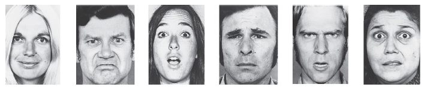
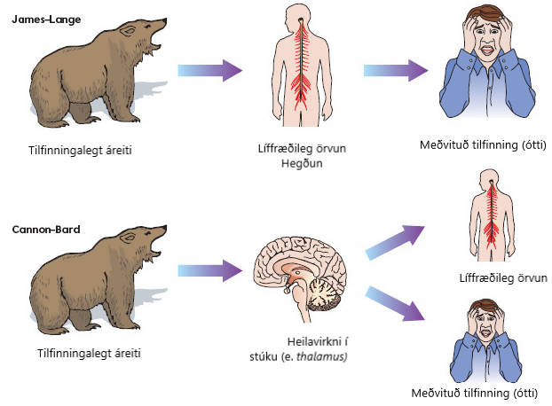

```{r setup, include=FALSE}
options(htmltools.dir.version = FALSE)
library(kableExtra)
knitr::opts_chunk$set(
  cache = FALSE,
  echo = FALSE,
  message = FALSE, 
  warning = FALSE,
  hiline = TRUE
)
```

```{r xaringan-themer, include=FALSE, warning=FALSE}
library(xaringanthemer)
style_duo_accent(
  primary_color = "#1381B0",
  secondary_color = "#FF961C",
  inverse_header_color = "#FFFFFF",
  inverse_background_color = "#4c516d", 
  colors = c(red = "#ff0019", black = "#000000"), inverse_text_color = "#FFFFFF"
)

library(xaringanExtra)
use_tile_view()
```

class: center, middle
background-image: url(images/Omniglot-logo.png)
background-size: 125px
background-position: 5% 92%

# Tilfinningar

### Móðurmálskennsla


Jón Ingi Hlynsson

```{r}

```

#### Omniglot AB 

#### Glærum síðast breytt: `r Sys.Date()`


---
background-image: url(images/Tilfinningar/tilfinningahjol.jpg)
background-size: 300px
background-position: 92% 8%


# Hvað eru tilfinningar?

???
- eru allar tilfinningar góðar?
 - en slæmar?

Við höfum öll einhverja hugmynd um hvað tilfinnig er en það er erfitt að skilgreina nákvæmlega hvað tilfinning er.


--
- Ástand líðanar: 

--
 - einkennist af einhvers konar líffræðilegri örvun 

--
 - sem hefur áhrif á **hugmyndir okkar um** heiminn og **hegðun** okkar

--
 - ýmist á jákvæðan eða neikvæðan máta  
 
--

**Málið.is**: geðhrif, kennd

???
- geðhrif vísa til sveiflna í skapi  

--

Fyrir vikið má taka ofantalda punkta sem svo:  

--

*Tilfinningar eru **ástand** sem felur í sér **flókið mynstur** af **hugrænum**, **líffræðilegum** og **hegðunarlegum viðbrögðum** við atburðum.*  

--

Tilfinningar hafa aðlögunargildi:

- Eykur líkur á að lifa af
- Mikilvægt fyrir nálægð/sambönd
- Mikilvæg fyrir félagsleg samskipti
- Mikilvægur þáttur lífsánægju

???
Um er að ræða eitthvað sem við finnum fyrir og engin leið fyrir okkur að vera 100% viss um að við upplifum öll það sama. Samt sem áður bendir allt til þess. Það er þó ekki það sama og að segja að svo sé raunin. 

---
background-image: url(images/Tilfinningar/6-tilfinningar.png)
background-size: 300px
background-position: 92% 8%


# Grunntilfinningar


Hvaða tilfinningar sérð þú á myndinni?

--
- Reiði
- Gleði/hamingja
- Leiði/sorg
- Reiði
- Ótti
- Undarandi

--

Tilfinningarnar á myndinni virðast vera sammannlegar, þvert yfir ólíka menningaheima.


---
background-image: url(images/Tilfinningar/lietome.jpeg)
background-size: 600px
background-position: 92% 8%


# Grunntilfinningar


Hvaða tilfinningar sérð þú á myndinni?


- Reiði
- Gleði/hamingja
- Leiði/sorg
- Reiði
- Ótti
- Undarandi


Tilfinningarnar á myndinni virðast vera sammannlegar, þvert yfir ólíka menningaheima.


**Fyrirlitning** er stundum höfð með sem grunntilfinning og þá verða þær sjö talsins  

--

**Hvað er hamingja?**

--
- Hamingja tengist ekki peningum, greind eða heilsufari
- Hamingjusamt fólk er ánægðara með sambönd sín.
- Að hafa tilgang fyrir lífi sínu tengist meiri hamingju eða vellíðan.
- Persónuleiki virðist skipta máli o.s.frv.

---

# Skoðum YouTube klippu


<iframe width="1202" height="450" src="https://www.youtube.com/embed/embYkODkzcs" title="YouTube video player" frameborder="0" allow="accelerometer; autoplay; clipboard-write; encrypted-media; gyroscope; picture-in-picture" allowfullscreen></iframe>


---

# Tvær meginkenningar um tilfinningar


.pull-left[**Kenning James-Lange um tilfinningar**:  
Bregðumst fyrst við líkamlega og upplifum svo tilfinninguna.  
**Dæmi**: Erum hrædd af því við hlaupum.  
- *„Við erum hrædd af því að hjartað slær hraðar, reið af því að við sláum frá okkur og döpur af því að við grátum“*  


**Kenning Cannon-Bard um tilfinningar**:  
Skynjum fyrst tilfinningar og síðan finnum við fyrir líkamlegum breytingum.  
**Dæmi**: hlaupum út af því við erum hrædd.  
- *Ekkert orsakasamband er á milli tilfinningalegrar upplifunar og lífeðlislegrar sjálfvirkrar örvunar, bæði eru óháð viðbrögð við aðstæðum.*
]

.pull-right[
```{r}

```

]

---

# Lesum texta um tilfinningar

```{r}
knitr::include_app("https://drive.google.com/file/d/1YABCMUhSVcgz8IfLp4fltjsn-RF2DiLP/preview", height = 500)
```


---
background-image: url(images/Tilfinningar/tilfinningahjol2.jpg)
background-size: 300px
background-position: 92% 92%


.center[
.middle[# Samræðuspruningar]
]


Er það rétt að sérhver einstaklingur sé ábyrgur fyrir eigin hamingju?  

--
Geta erfiðleikar stuðlað að hamingju?  

--
Hvort skiptir meira máli til þess að vera hamingjusöm/samur - hugarástand eða ytri aðstæður.  

--
Getur verið að suma langi til þess að gera eitthvað sem stangast á við hamingju þeirra?  

--
Hver er munurinn á hamingju og gleði?  

--
Hvernig myndir þú skilgreina hamingju?


---

.center[
.middle[# Heimaverkefni]
]

Taktu til tvö blöð og skráðu niður svör við tveimur spurningum. Á annað blaðið skal skrá niður eins mörg svör og þér detta í hug á ákveðnum tíma við spurningunni: **a) Hvað telur þú að sé líklegt til þess að gera fólk óhamingjusamt?**

Á hitt blaðið skrá  niður eins mörg svör og þér dettur í hug á ákveðnum tíma við spurningunni: **b) Hvað telur þú að sé líklegt til þess að gera fólk hamingjusamt?**  

--

Áætlaðu þrjátíu mínútum í verkefnið.

Skráðu niður a.m.k. fimm svör við hvorri spurningu.


---
class: center middle

# Fyrir næsta tíma

  <br>
  <br>
  
Vinna heimaverkefnið sem útlistað var á glærunni á undan 

  <br>
  <br>
  

--

```{r}

```


---
class: center middle inverse


# Takk fyrir tímann í dag